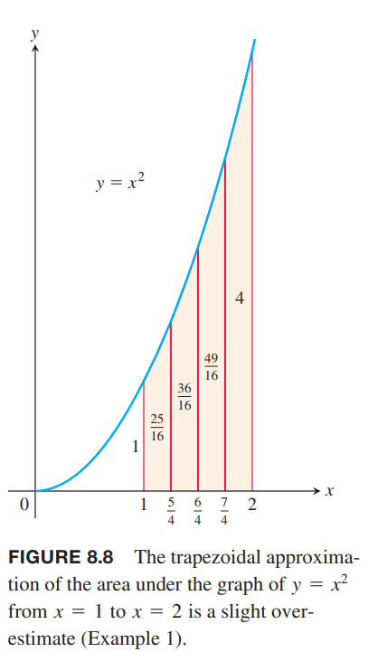

### 梯形近似
梯形近似方法使用梯形替换矩形来替代曲线对应的某一小段下的图形，如下图所示。

对于点 $x_0,x_1,x_2,\cdots,x_n$ 所对应的区间，不要求是等宽的，不过等宽的非常容易计算。因此对于等宽情况，宽度是
$$\Delta x=\frac{b-a}{n}$$
这个长度称为步长。第 $i$ 个梯形的面积是
$$\Delta x(\frac{y_{i-1}+y_i}{2})=\frac{\Delta x}{2}(y_{i-1}+y_i)$$
那么曲线 $y=f(x)$ 下方的面积近似于所有梯形之和。
$$\begin{aligned}
T&=\frac{1}{2}(y_0+y_1)\Delta x+\frac{1}{2}(y_1+y_2)\Delta x+\cdots+\frac{1}{2}(y_{n-2}+y_{n-1})\Delta x+\frac{1}{2}(y_{n-1}+y_n)\Delta x\\
&=\Delta x(\frac{1}{2}y_0+y_1+y_2+\cdots+y_{n-1}+\frac{1}{n}y_n)\\
&=\frac{\Delta x}{2}(y_0+2y_1+2y_2+\cdots+2y_{n-1}+y_n)
\end{aligned}$$

例1 使用 $n=4$ 的梯形近似法估算 $\int_1^2 x^2dx$。比较估算值于精确值。

解：如下图所示，区间 $[1,2]$ 平均分成四个子区间。

下表是对应的横纵坐标的值

| $x$ | $y=x^2$ |
|--|--|
| $1$ | $1$ |
| $\frac{5}{4}$ | $\frac{25}{16}$ |
| $\frac{4}{4}$ | $\frac{36}{16}$ |
| $\frac{7}{4}$ | $\frac{49}{16}$ |
| $2$ | $4$ |

代入公式
$$\begin{aligned}
T&=\frac{\Delta x}{2}(y_0+2y_1+2y_2+2y_3+y_4)\\
&=\frac{1}{8}(1+\frac{50}{16}+\frac{72}{16}+\frac{98}{16}+4)\\
&=\frac{75}{32}\\
&=2.34375
\end{aligned}$$
二次曲线是下凸的，所以梯形面积比曲线下的面积略微大一点点。精确积分是
$$\int_1^2 x^2dx=\frac{x^3}{3}\bigg|_1^2=\frac{7}{3}$$
误差比例是
$$(2.34375-\frac{7}{3})/\frac{7}{3}\approx 0.00446=0.446\%$$

### 辛普森规则：使用抛物线近似
