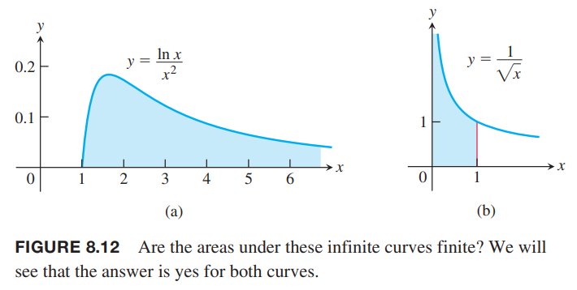
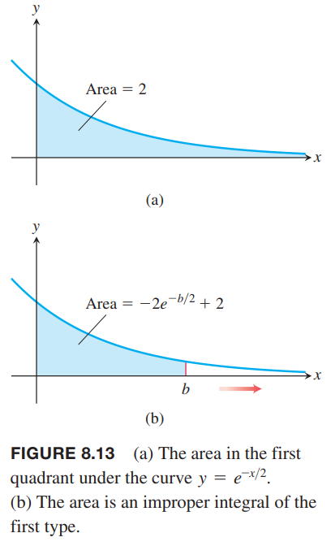
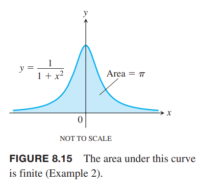
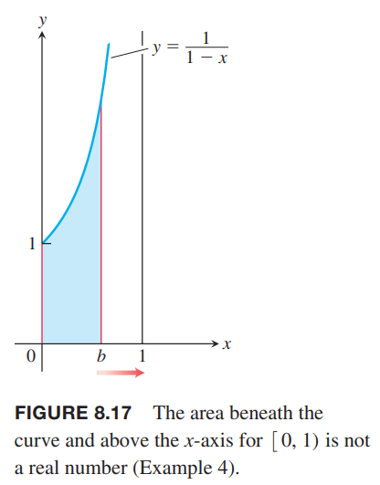

截至目前，我们所求的积分满足两个条件：一是积分的定义域 $[a,b]$ 是有限的；二是被积函数在定义域上的值域是有限的。但是实际有的积分不满足这个条件。比如函数 $y=\frac{\ln x}{x^2}, 1\leq x<\infty$，定义域是无限的；而函数 $y=\frac{1}{\sqrt{x}},0\leq x\leq 1$ 的值域是无限的。如下图所示。这些积分被称为广义积分或反常积分（`improper integrals`）。在概率论和研究一些无穷级数的收敛性质时，广义积分很有用。

### 无穷极限积分
首先考虑定义域无穷的情况。如下图（a）所示，函数 $y=e^{-x/2}$ 的定义域是无限的。但是可以首先对某个点，比如 $b$，如下图（b）所示，求定积分，然后令其趋于无穷，得到区域的面积。

$$A(b)=\int_0^b e^{-x/2}dx=-2{-x/2}\bigg|_0^b=-2e^{-b/2}+2$$
当 $b\to\infty$ 时，求面积 $A(b)$ 的极限。
$$\lim_{b\to\infty}A(b)=\lim_{b\to\infty}(-2e^{-b/2}+2)=2$$
所以
$$\int_0^\infty e^{-x/2}dx=\lim_{b\to\infty}\int_0^\infty e^{-x/2}dx=2$$

定义域无穷的积分称为 I 型广义积分。

如果 $f(x)$ 在 $[a,\infty)$ 上连续，那么
$$\int_a^\infty f(x)dx=\lim_{b\to\infty}\int_a^b f(x)dx$$

如果 $f(x)$ 在 $(-\infty,b]$ 上连续，那么
$$\int_{-\infty}^b f(x)dx=\lim_{a\to\infty}\int_a^b f(x)dx$$

如果 $f(x)$ 在 $(-\infty,\infty)$ 上连续，那么
$$\int_{-\infty}^\infty f(x)dx=\int_{-\infty}^c f(x)dx+\int_c^\infty f(x)dx$$

对于每一种情况，如果极限存在且有限，我们称广义积分收敛，且极限值是广义积分的值，反之，广义积分发散。

对于最后一种情况，$c$ 的选取不重要，方便计算即可。

如果在定义域上有 $f\geq 0$，那么广义积分可以看作是函数 $f$ 曲线下的面积。如上图所示，广义积分收敛，那么面积是有限的，就是 2。如果广义积分是发散的，曲线下的面积无限大。

例1 曲线 $y=(\ln x)/x^2$ 从 $x=1$ 到 $x=\infty$ 下的面积是有限的吗？如果是，值是多少？

解：如下图所示，我们先计算从 1 到 $b$ 的面积。

$$\begin{aligned}
\int_1^b\frac{\ln x}{x^2}dx&=\bigg[(\ln x)(-\frac{1}{x})\bigg]_1^b-\int_1^b -\frac{1}{x}\frac{1}{x}dx&&u=\ln x,v'=1/x^2\\
&=-\frac{\ln b}{b}-\frac{1}{x}\bigg|_1^b\\
&=-\frac{\ln b}{b}-\frac{1}{b}+1
\end{aligned}$$

求 $b\to\infty$ 时面积的极限
$$\begin{aligned}
\int_1^\infty\frac{\ln x}{x^2}dx&=\lim_{b\to\infty}\int_1^b\frac{\ln x}{x^2}dx\\
&=\lim_{b\to\infty}(-\frac{\ln b}{b}-\frac{1}{b}+1)\\
&=-(\lim_{b\to\infty}\frac{\ln b}{b})-0+1\\
&=-(\lim_{b\to\infty}\frac{1/b}{1})+1\\
&=1
\end{aligned}$$
广义积分收敛，面积是有限的，1。

例2 求
$$\int_{-\infty}^\infty\frac{dx}{1+x^2}$$

解：我们选择 $c=0$，那么
$$\int_{-\infty}^\infty\frac{dx}{1+x^2}=\int_{-\infty}^0\frac{dx}{1+x^2}+\int_0^\infty\frac{dx}{1+x^2}$$

依次计算右边的每一项。
$$\begin{aligned}
\int_{-\infty}^0\frac{dx}{1+x^2}&=\lim_{a\to -\infty}\int_a^0\frac{dx}{1+x^2}\\
&=\lim_{a\to -\infty} \tan^{-1}x\bigg|_a^0\\
&=\lim_{a\to -\infty}(\tan^{-1}0-\tan^{-1}a)\\
&=0-(-\frac{\pi}{2})\\
&=\frac{\pi}{2}
\end{aligned}$$
$$\begin{aligned}
\int_0^\infty\frac{dx}{1+x^2}&=\lim_{b\to\infty}\int_0^b\frac{dx}{1+x^2}\\
&=\lim_{b\to\infty}\tan^{-1}x\bigg|_0^b\\
&=\lim_{b\to\infty}(\tan^{-1}b-\tan^{-1}0)\\
&=\frac{\pi}{2}
\end{aligned}$$
因此
$$\int_{-\infty}^\infty\frac{dx}{1+x^2}=\pi$$
广义积分就是曲线下方的面积，如下图所示。

### $\int_1^\infty\frac{dx}{x^p}$ 的积分
$y=1/x$ 是形如$y=1/x^p$ 的广义积分收敛和分散的分界线。

例3 当 $p$ 为何值时 $\int_1^\infty\frac{dx}{x^p}$ 收敛？如果收敛，值是多少？

解：如果 $p\neq 1$
$$\int_1^b\frac{dx}{x^p}=\frac{x^{-p+1}}{-p+1}\bigg|_1^b=\frac{1}{1-p}(b^{-p+1}-1)=\frac{1}{1-p}(\frac{1}{b^{p-1}-1})$$
当 $b\to\infty$ 时
$$\lim_{b\to\infty}\frac{1}{b^{p-1}}=\begin{cases}
0,&&p>1\\\infty,&&p<1
\end{cases}$$
所以
$$\begin{aligned}
\int_1^\infty\frac{dx}{x^p}&=\lim_{b\to\infty}\int_1^b\frac{dx}{x^p}\\
&=\lim_{b\to\infty}\frac{1}{1-p}(\frac{1}{b^{p-1}-1})\\
&=\begin{cases}
\frac{1}{p-1},&&p>1\\
\infty,&&p<1
\end{cases}
\end{aligned}$$
因此，当 $p>1$ 时，积分收敛于 $\frac{1}{p-1}$，当 $p<1$ 时，积分发散。

如果 $p=1$，那么
$$\begin{aligned}
\int_1^\infty\frac{dx}{x^p}&=\int_1^\infty\frac{dx}{x}\\
&=\lim_{b\to\infty}\int_1^b\frac{dx}{x}\\
&=\lim_{b\to\infty}\ln x\bigg|_1^b\\
&=\lim_{b\to\infty}(\ln b-\ln 1)\\
&=\infty
\end{aligned}$$
积分也是发散的。

### 有垂直渐近线的积分
另外一种广义积分是在被积函数在积分区间的端点处或者中间某点处有垂直渐近线，即无穷间断点。如果被积函数 $f$ 在积分区间上为正，可以将广义积分看作是曲线下的面积。

计算 $y=1/\sqrt{x}$ 从 $x=0$ 到 $x=1$ 的积分。如下图所示，首先计算 $a$ 到 $1$ 积分。

$$\int_a^1\frac{dx}{\sqrt{x}}=2\sqrt{x}\bigg|_a^1=2-2\sqrt{a}$$
求 $a\to 0^+$ 时的极限
$$\lim_{a\to 0^+}\int_a^1\frac{dx}{\sqrt{x}}=\lim_{a\to 0^+}(2-2\sqrt{a})=2$$
因此从 0 到 1 曲线下的面积是有限的
$$\int_0^1\frac{dx}{\sqrt{x}}=\lim_{a\to 0^+}\int_a^1\frac{dx}{\sqrt{x}}=2$$

在积分区间存在无穷间断点的积分称为 II 型广义积分。

如果 $f(x)$ 在 $(a,b]$ 上连续在 $a$ 处不连续，那么
$$\int_a^bf(x)dx=\lim_{c\to a^+}\int_c^bf(x)dx$$

如果 $f(x)$ 在 $[a,b)$ 上连续在 $b$ 处不连续，那么
$$\int_a^bf(x)dx=\lim_{c\to b^-}\int_a^cf(x)dx$$

如果 $f(x)$ 在 $c,a<c<b$ 处不连续，在区间 $[a,c)\cup(c,b]$ 上连续，那么
$$\int_a^bf(x)dx=\int_a^cf(x)dx+\int_c^bf(x)dx$$

对每一种情况而言，如果极限存在且有限，那么广义积分收敛且极限值是广义积分的值，否则，积分发散。

对于第三种情况，右边的两个广义积分都收敛时积分才收敛，否则积分是发散的。

例4 求
$$\int_0^1\frac{1}{1-x}dx$$
解：被积函数 $f(x)=1/(1-x)$ 在 $[0,1)$ 上连续，在 $x=1$ 处不连续。函数图像如下所示。

$$\begin{aligned}
\lim_{b\to 1^{-1}}\int_0^b\frac{1}{1-x}dx&=\lim_{b\to 1^{-1}}\bigg[-\ln|1-x|\bigg]_0^b\\
&=\lim_{b\to 1^{-1}}[-\ln(1-b)+0]\\
&=\infty
\end{aligned}$$
极限是无穷大，所以积分是发散的。

例5 求
$$\int_0^3\frac{dx}{(x-1)^{2/3}}$$
解：被积函数在 $x=1$ 处是无穷间断点，在 $[0,1)$ 和 $(1,3]$ 上连续，如下图所示。

根据 II 型广义积分定义的第三种情况
$$\int_0^3\frac{dx}{(x-1)^{2/3}}=\int_0^1\frac{dx}{(x-1)^{2/3}}+\int_1^3\frac{dx}{(x-1)^{2/3}}$$
$$\begin{aligned}
\int_0^1\frac{dx}{(x-1)^{2/3}}&=\lim_{b\to 1^-}\int_0^b\frac{dx}{(x-1)^{2/3}}\\
&=\lim_{b\to 1^-}3(x-1)^{1/3}\bigg|_0^b\\
&=\lim_{b\to 1^-}[3(b-1)^{1/3}+3]\\
&=3
\end{aligned}$$
$$\begin{aligned}
\int_1^3\frac{dx}{(x-1)^{2/3}}&=\lim_{c\to 1^+}\int_c^3\frac{dx}{(x-1)^{2/3}}\\
&=\lim_{c\to 1^+}3(x-1)^{1/3}\bigg|_c^3\\
&=\lim_{c\to 1^+}[3(3-1)^{1/3}-3(c-1)^{1/3}]\\
&=3\sqrt[3]{2}
\end{aligned}$$
所以
$$\int_0^3\frac{dx}{(x-1)^{2/3}}=3+3\sqrt[3]{2}$$

