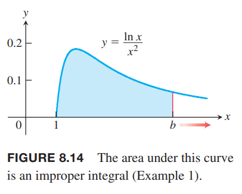

截至目前，我们所求的积分满足两个条件：一是积分的定义域 $[a,b]$ 是有限的；二是被积函数在定义域上的值域是有限的。但是实际有的积分不满足这个条件。比如函数 $y=\frac{\ln x}{x^2}, 1\leq x<\infty$，定义域是无限的；而函数 $y=\frac{1}{\sqrt{x}},0\leq x\leq 1$ 的值域是无限的。如下图所示。这些积分被称为广义积分或反常积分（`improper integrals`）。在概率论和研究一些无穷级数的收敛性质时，广义积分很有用。

### 无穷极限积分
首先考虑定义域无穷的情况。如下图（a）所示，函数 $y=e^{-x/2}$ 的定义域是无限的。但是可以首先对某个点，比如 $b$，如下图（b）所示，求定积分，然后令其趋于无穷，得到区域的面积。

$$A(b)=\int_0^b e^{-x/2}dx=-2{-x/2}\bigg|_0^b=-2e^{-b/2}+2$$
当 $b\to\infty$ 时，求面积 $A(b)$ 的极限。
$$\lim_{b\to\infty}A(b)=\lim_{b\to\infty}(-2e^{-b/2}+2)=2$$
所以
$$\int_0^\infty e^{-x/2}dx=\lim_{b\to\infty}\int_0^\infty e^{-x/2}dx=2$$

定义域无穷的积分称为 I 型广义积分。

如果 $f(x)$ 在 $[a,\infty)$ 上连续，那么
$$\int_a^\infty f(x)dx=\lim_{b\to\infty}\int_a^b f(x)dx$$

如果 $f(x)$ 在 $(-\infty,b]$ 上连续，那么
$$\int_{-\infty}^b f(x)dx=\lim_{a\to\infty}\int_a^b f(x)dx$$

如果 $f(x)$ 在 $(-\infty,\infty)$ 上连续，那么
$$\int_{-\infty}^\infty f(x)dx=\int_{-\infty}^c f(x)dx+\int_c^\infty f(x)dx$$

对于每一种情况，如果极限存在且有限，我们称广义积分收敛，且极限值是广义积分的值，反之，广义积分发散。

对于最后一种情况，$c$ 的选取不重要，方便计算即可。

如果在定义域上有 $f\geq 0$，那么广义积分可以看作是函数 $f$ 曲线下的面积。如上图所示，广义积分收敛，那么面积是有限的，就是 2。如果广义积分是发散的，曲线下的面积无限大。

例1 曲线 $y=(\ln x)/x^2$ 从 $x=1$ 到 $x=\infty$ 下的面积是有限的吗？如果是，值是多少？

解：如下图所示，我们先计算从 1 到 $b$ 的面积。
$$\begin{aligned}
\int_1^b\frac{\ln x}{x^2}dx&=\bigg[(\ln x)(-\frac{1}{x})\bigg]_1^b-\int_1^b -\frac{1}{x}\frac{1}{x}dx&&u=\ln x,v'=1/x^2\\
&=-\frac{\ln b}{b}-\frac{1}{x}\bigg|_1^b\\
&=-\frac{\ln b}{b}-\frac{1}{b}+1
\end{aligned}$$

求 $b\to\infty$ 时面积的极限
$$\begin{aligned}
\int_1^\infty\frac{\ln x}{x^2}dx&=\lim_{b\to\infty}\int_1^b\frac{\ln x}{x^2}dx\\
&=\lim_{b\to\infty}(-\frac{\ln b}{b}-\frac{1}{b}+1)\\
&=-(\lim_{b\to\infty}\frac{\ln b}{b})-0+1\\
&=-(\lim_{b\to\infty}\frac{1/b}{1})+1\\
&=1
\end{aligned}$$
广义积分收敛，面积是有限的，1。

