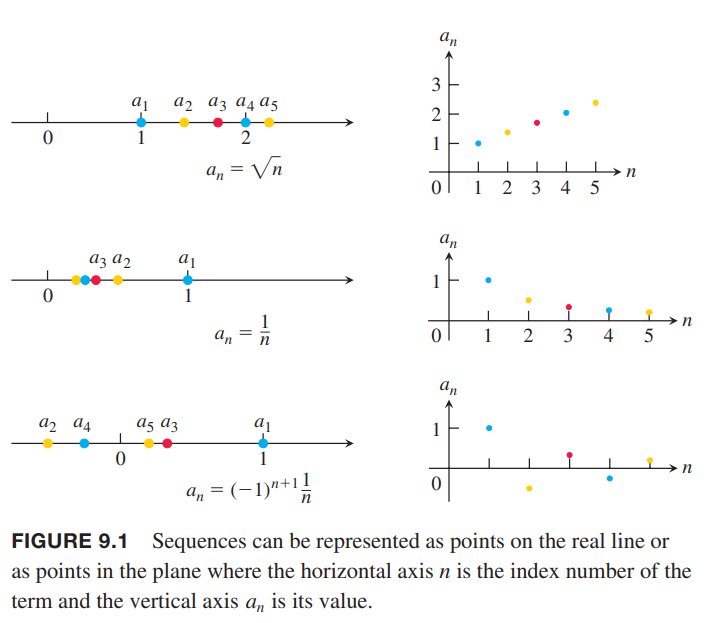
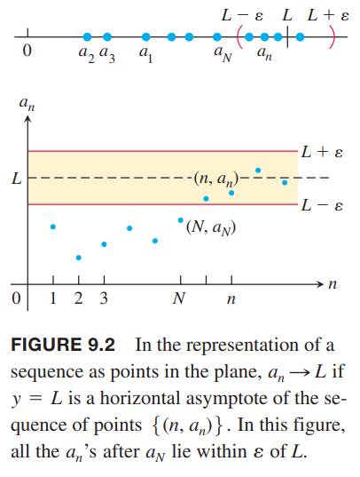

### 数列的表示
数列是给定顺序的数的列表
$$a_1,a_2,a_3,\cdots,a_n,\cdots$$
每一个数称为数列的项（`term`）。整数 $n$ 称为索引或下标（`index`），表示 $a_n$ 在数列的位置。顺序是非常重要的，数列 $2,4,6,8,\cdots$ 和数列 $4,2,6,8,\cdots$ 是不同的数列。

无限数列（`infinite sequence`）可以看作一个函数，定义域是整数的集合。比如
$$2,4,6,8,\cdots,2n,\cdots$$
就是把 1 映射到 2，2 映射到 4，通项公式是 $a_n=2n$。

我们可以任意改变下标。比如数列
$$12,14,16,18,\cdots$$
可以看作 $a_n=10+2n$，其中 $n$ 从 1 开始。也可以简单地认为是 $b_n=2n$，不过 $n$ 从 6 开始。

数列通常用通项公式表示，比如
$$a_n=\sqrt{n},b_n=(-1)^{n+1}\frac{1}{n},c_n=\frac{n-1}{n},d_n=(-1)^{n+1}$$
用列表表示是
$$\begin{aligned}
\{a_n\}&=\{\sqrt{1},\sqrt{2},\sqrt{3},\cdots,\sqrt{n},\cdots\}\\
\{b_n\}&=\{1,-\frac{1}{2},\frac{1}{3},\cdots,(-1)^{n+1}\frac{1}{n},\cdots\}\\
\{c_n\}&=\{0,\frac{1}{2},\frac{2}{3},\cdots,\frac{n-1}{n},\cdots\}\\
\{d_n\}&=\{1,-1,1,-1,\cdots,(-1)^{n+1},\cdots\}
\end{aligned}$$
有时，通项公式也可以写作
$$\{a_n\}=\{\sqrt{n}\}_{n=1}^\infty,\{b_n\}=\{(-1)^{n+1}\frac{1}{n}\}_{n=1}^\infty$$
下图展示了两种使用图像表示数列的方式。左边图是在实数轴上标记 $a_1,a_2,a_3,\cdots,a_n,\cdots$。右边的方式表达了函数的思想，输入是整数，这些点分别是 $(1,a_1),(2,a_2),\cdots,(n,a_n),\cdots$。

### 收敛和发散
有的数列随着 $n$ 的增大而趋于某个值。比如
$$\{1,\frac{1}{2},\frac{1}{3},\cdots,\frac{1}{n},\cdots\}$$
随着 $n$ 增大趋于 0，再比如
$$\{0,\frac{1}{2},\frac{2}{3},\frac{3}{4},\cdots,\frac{n-1}{n},\cdots\}$$
随着 $n$ 增大趋于 1。不过，像如下数列
$$\{\sqrt{1},\sqrt{2},\sqrt{3},\cdots,\sqrt{n},\cdots\}$$
随着 $n$ 增大而无限大，像如下数列
$$\{1,-1,1,-1,1,\cdots,(-1)^{n+1},\cdots\}$$
反复在 1 和 -1 之间变化，不会趋于某个值。

**定义**
> 数列 $\{a_n\}$ 收敛于值 $L$，如果给定任意 $\varepsilon>0$，都能找到一个 $N$ 使得
> $$|a_n-L|<\varepsilon, n>N$$
> 如果这样的数 $L$ 不存在，那么数列 $\{a_n\}$ 发散。
> 
> 如果 $\{a_n\}$ 收敛于 $L$，写作 $\lim_{n\to\infty}a_n=L$，或者简写作 $a_n\to L$，并称 $L$ 是数列的极限。

如下图所示。

这个定义和 $x$ 趋于无穷时 $f(x)$ 的极限的定义非常类似，后续会使用这一联系来求数列的极限。

例1 证明

（a）$\lim_{n\to\infty}\frac{1}{n}=0$

（b）$\lim_{n\to\infty}k=k,k \text{是常数}$

证明：（a）令 $\varepsilon>0$ 已给定。现在需要求存在这样的一个 $N$ 使得
$$\bigg|\frac{1}{n}-0\bigg|<\varepsilon,n>N$$
那么 $1/n<\varepsilon$，或 $n>1/\varepsilon$。如果 $N$ 是比 $1/\varepsilon$ 更大的数，那么上述不等式在 $n>N$ 的条件都能成立。

（b）同样，不等式是
$$|k-k|<\varepsilon,n>N$$
由于 $k-k=0$，那么任意正整数 $N$ 都能使上述不等式成立。

例2 证明数列
$$\{1,-1,1,-1,1,\cdots,(-1)^{n+1},\cdots\}$$
是发散的。

证明：反证法。假定趋于某个数 $L$。给定 $\varepsilon=\frac{1}{2}$。由于 1 会反复出现，即任意 $N$ 之后还会出现 1，这就要求 1 距离 $L$ 小于 $\varepsilon=1/2$，即 $|L-1|<1/2$，所以 $1/2<L<3/2$。同样的，-1 也会反复出现，那么 $|L-(-1)|<1/2$，所以 $-3/2<L<-1/2$。但是同时满足这两个区间的 $L$ 不存在。

这个题目中给定任意 $\varepsilon<1$ 均可。
$$\tag*{$\blacksquare$}$$

数列 $\sqrt{n}$ 也发散，但是原因是不同的。随着 $n$ 的增加，
