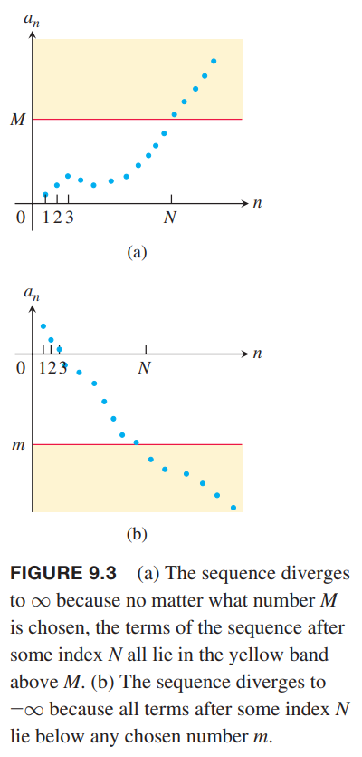
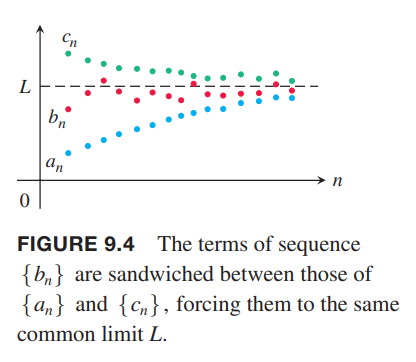
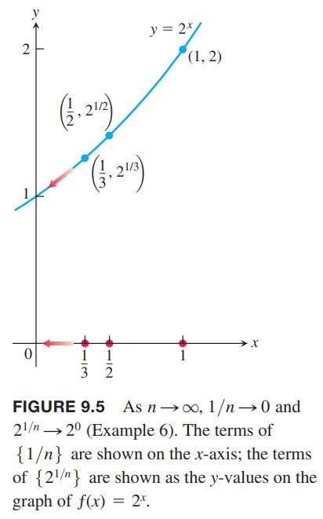

### 数列的表示
数列是给定顺序的数的列表
$$a_1,a_2,a_3,\cdots,a_n,\cdots$$
每一个数称为数列的项（`term`）。整数 $n$ 称为索引或下标（`index`），表示 $a_n$ 在数列的位置。顺序是非常重要的，数列 $2,4,6,8,\cdots$ 和数列 $4,2,6,8,\cdots$ 是不同的数列。

无限数列（`infinite sequence`）可以看作一个函数，定义域是整数的集合。比如
$$2,4,6,8,\cdots,2n,\cdots$$
就是把 1 映射到 2，2 映射到 4，通项公式是 $a_n=2n$。

我们可以任意改变下标。比如数列
$$12,14,16,18,\cdots$$
可以看作 $a_n=10+2n$，其中 $n$ 从 1 开始。也可以简单地认为是 $b_n=2n$，不过 $n$ 从 6 开始。

数列通常用通项公式表示，比如
$$a_n=\sqrt{n},b_n=(-1)^{n+1}\frac{1}{n},c_n=\frac{n-1}{n},d_n=(-1)^{n+1}$$
用列表表示是
$$\begin{aligned}
\{a_n\}&=\{\sqrt{1},\sqrt{2},\sqrt{3},\cdots,\sqrt{n},\cdots\}\\
\{b_n\}&=\{1,-\frac{1}{2},\frac{1}{3},\cdots,(-1)^{n+1}\frac{1}{n},\cdots\}\\
\{c_n\}&=\{0,\frac{1}{2},\frac{2}{3},\cdots,\frac{n-1}{n},\cdots\}\\
\{d_n\}&=\{1,-1,1,-1,\cdots,(-1)^{n+1},\cdots\}
\end{aligned}$$
有时，通项公式也可以写作
$$\{a_n\}=\{\sqrt{n}\}_{n=1}^\infty,\{b_n\}=\{(-1)^{n+1}\frac{1}{n}\}_{n=1}^\infty$$
下图展示了两种使用图像表示数列的方式。左边图是在实数轴上标记 $a_1,a_2,a_3,\cdots,a_n,\cdots$。右边的方式表达了函数的思想，输入是整数，这些点分别是 $(1,a_1),(2,a_2),\cdots,(n,a_n),\cdots$。

### 收敛和发散
有的数列随着 $n$ 的增大而趋于某个值。比如
$$\{1,\frac{1}{2},\frac{1}{3},\cdots,\frac{1}{n},\cdots\}$$
随着 $n$ 增大趋于 0，再比如
$$\{0,\frac{1}{2},\frac{2}{3},\frac{3}{4},\cdots,\frac{n-1}{n},\cdots\}$$
随着 $n$ 增大趋于 1。不过，像如下数列
$$\{\sqrt{1},\sqrt{2},\sqrt{3},\cdots,\sqrt{n},\cdots\}$$
随着 $n$ 增大而无限大，像如下数列
$$\{1,-1,1,-1,1,\cdots,(-1)^{n+1},\cdots\}$$
反复在 1 和 -1 之间变化，不会趋于某个值。

**定义**
> 数列 $\{a_n\}$ 收敛于值 $L$，如果给定任意 $\varepsilon>0$，都能找到一个 $N$ 使得
> $$|a_n-L|<\varepsilon, n>N$$
> 如果这样的数 $L$ 不存在，那么数列 $\{a_n\}$ 发散。
> 
> 如果 $\{a_n\}$ 收敛于 $L$，写作 $\lim_{n\to\infty}a_n=L$，或者简写作 $a_n\to L$，并称 $L$ 是数列的极限。

如下图所示。

这个定义和 $x$ 趋于无穷时 $f(x)$ 的极限的定义非常类似，后续会使用这一联系来求数列的极限。

例1 证明

（a）$\lim_{n\to\infty}\frac{1}{n}=0$

（b）$\lim_{n\to\infty}k=k,k \text{是常数}$

证明：（a）令 $\varepsilon>0$ 已给定。现在需要求存在这样的一个 $N$ 使得
$$\bigg|\frac{1}{n}-0\bigg|<\varepsilon,n>N$$
那么 $1/n<\varepsilon$，或 $n>1/\varepsilon$。如果 $N$ 是比 $1/\varepsilon$ 更大的数，那么上述不等式在 $n>N$ 的条件都能成立。

（b）同样，不等式是
$$|k-k|<\varepsilon,n>N$$
由于 $k-k=0$，那么任意正整数 $N$ 都能使上述不等式成立。

例2 证明数列
$$\{1,-1,1,-1,1,\cdots,(-1)^{n+1},\cdots\}$$
是发散的。

证明：反证法。假定趋于某个数 $L$。给定 $\varepsilon=\frac{1}{2}$。由于 1 会反复出现，即任意 $N$ 之后还会出现 1，这就要求 1 距离 $L$ 小于 $\varepsilon=1/2$，即 $|L-1|<1/2$，所以 $1/2<L<3/2$。同样的，-1 也会反复出现，那么 $|L-(-1)|<1/2$，所以 $-3/2<L<-1/2$。但是同时满足这两个区间的 $L$ 不存在。

这个题目中给定任意 $\varepsilon<1$ 均可。
$$\tag*{$\blacksquare$}$$

数列 $\sqrt{n}$ 也发散，但是原因是不同的。随着 $n$ 的增加，值比任意给定数都要大。数列的行为描述为
$$\lim_{n\to\infty}\sqrt{n}=\infty$$
极限写作无穷，不是随着 $n$ 的增加说 $a_n$ 与 $\infty$ 之间的差距越来越小，也不是说数列趋于某个无穷大的值。仅仅表示随着 $n$ 的增加 $a_n$ 最终会比任意给定的数都要打。如下图（a）所示。数列也可以趋于负无穷，如下图（b）所示。

**定义**
> 如果每一个数 $M$ 都存在一个整数 $N$ 使得对所有 $n>N$ 都有 $a_n>M$，那么数列 $\{a_n\}$ 发散到正无穷。记作
> $$\lim_{n\to\infty}a_n=\infty,a_n\to\infty$$
> 类似地，对于每一个数 $m$ 都存在一个整数 $N$ 使得对所有 $n>M$ 都有 $a_n<m$，那么数列 $\{a_n\}$ 发散到负无穷。记作
> $$\lim_{n\to\infty}a_n= -\infty,a_n\to -\infty$$

正如之前例 2 所示，有时发散数列并不趋于无穷。数列 $\{1,-2,3,-4,5,-6,7,\cdots\}$ 和 $\{1,0,2,0,3,0,\cdots\}$ 也是这样的例子。

数列的前面若干项并不影响数列的收敛性。

### 求数列的极限
由于数列就是定义域是正整数的函数，所以函数的极限相关的定理也有数列的版本。

**定理 1**
> 令 $\{a_n\},\{b_n\}$ 是实数数列，$A,B$ 是实数。如果 $\lim_{n\to\infty}a_n=A,\lim_{n\to\infty}b_n=B$，那么
> $$\lim_{n\to\infty}(a_n+b_n)=A+B$$
> $$\lim_{n\to\infty}(a_n-b_n)=A-B$$
> $$\lim_{n\to\infty}(k\cdot b_n)=k\cdot B$$
> $$\lim_{n\to\infty}(a_n\cdot b_n)=A\cdot B$$
> $$\lim_{n\to\infty}\frac{a_n}{b_n}=\frac{A}{B}$$

证明和 2.2 节定理 1 类似，不再赘述。

例3 结合定理 1 和例 1 我们有

（a）
$$\lim_{n\to\infty}(-\frac{1}{n})=-\lim_{n\to\infty}\frac{1}{n}=0$$
（b）
$$\lim_{n\to\infty}(\frac{n-1}{n})=\lim_{n\to\infty}(1-\frac{1}{n})=1-\lim_{n\to\infty}\frac{1}{n}=1$$
（c）
$$\lim_{n\to\infty}\frac{5}{n^2}=5\lim_{n\to\infty}\frac{1}{n}\lim_{n\to\infty}\frac{1}{n}=0$$
（d）
$$\lim_{n\to\infty}\frac{4-7n^6}{n^6+3}=\lim_{n\to\infty}\frac{(4/n^6-7)}{1+3/n^6}=-7$$
$$\tag*{$\blacksquare$}$$

使用定理 1 要小心。比如 $\{a_n+b_n\}$ 有极限不意味着 $\{a_n\},\{b_n\}$ 有极限，举个具体例子，$\{a_n\}=\{1,2,3,4,\cdots\}$ 和 $\{b_n\}=\{-1,-2,-3,-4,\cdots\}$ 都是发散的，但是和 $\{a_n+b_n\}=\{0,0,0,0,\cdots\}$ 收敛于零。

定理 1 的一个推论是发散数列 $\{a_n\}$ 的非零倍数也是发散的。反证法。假定对某些 $c$ $\{ca_n\}$ 收敛，那么令 $k=1/c$，应用乘法规则，得到
$$\bigg\{\frac{1}{c}\cdot ca_n\bigg\}=\{a_n\}$$
$\{ca_n\}$ 不能收敛，否则的话 $\{a_n\}$ 是收敛的。

**定理 2 数列的夹逼定理**
> 令 $\{a_n\},\{b_n\},\{c_n\}$ 是实数数列。如果对于所有 $n>N$ 都有 $a_n\leq b_n\leq c_n$，且 $\lim_{n\to\infty} a_n=\lim_{n\to\infty} c_n=L$，那么 $\lim_{n\to\infty} b_n=L$。
>
> 

定理 2 的一个直接推论是如果 $|b_n|\leq c_n$，且 $c_n\to 0$，由于 $-c_n\leq b_n\leq c_n$，所以 $b_n\to 0$。

例4 由 $1/n\to 0$，可知

（a）因为
$$-\frac{1}{n}\leq\frac{\cos n}{n}\leq\frac{1}{n}$$
那么
$$\frac{\cos n}{n}\to 0$$
（b）因为
$$0\leq\frac{1}{2^n}\leq\frac{1}{n}$$
所以
$$\frac{1}{2^n}\to 0$$
（c）因为
$$-\frac{1}{n}\leq(-1)^n\frac{1}{n}\leq\frac{1}{n}$$
所以
$$(-1)^n\frac{1}{n}\to 0$$
（d）因为
$$-|a_n|\leq a_n\leq |a_n|$$
所以如果 $|a_n|\to 0$ 那么
$$a_n\to 0$$

**定理 3 数列的连续函数定理**
> 令 $\{a_n\}$ 是实数数列。如果 $a_n\to L$ 且 $f$ 是一个在 $L$ 处连续在所有 $a_n$ 上均有定义的函数，那么 $f(a_n)\to f(L)$

例5 证明
$$\sqrt{\frac{n+1}{n}}\to 1$$
证明：我们知道 $(n+1)/n\to 1$，取 $f(x)=\sqrt{x},L=1$，根据定理 3 有$\sqrt{(n+1)/n}\to \sqrt{1}=1$。

例6 数列 $\{1/n\}$ 趋于零。取 $a_n=1/n,f(x)=2^x,L=0$，根据定理 3 有 $2^{1/n}=f(1/n)\to f(L)=2^0=1$。所以数列 $\{2^{1/n}\}$ 收敛于 1。如下图所示。

### 使用洛必达法则
**定理 4**
> 假设 $\{a_n\}$ 是实数数列，$f(x)$ 在所有 $x\geq n_0$ 上都有定义，且 $a_n=f(n)$，那么
> $$\lim_{n\to\infty}a_n=L,\text{ whenever }\lim_{x\to\infty}f(x)=L$$

证明：假定 $\lim_{x\to\infty}f(x)=L$，那么给定每一个数 $\varepsilon$ 都存在一个数 $M$ 满足
$$|f(x)-L|<\varepsilon,x>M$$
令 $N$ 大于 $M$ 且大于等于 $n_0$。由于 $a_n=f(n)$，那么对于所有 $n>N$ 都有
$$|a_n-L|=|f(n)-L|<\varepsilon$$
$$\tag*{$\blacksquare$}$$

例7 求证
$$\lim_{n\to\infty}\frac{\ln n}{n}=0$$
证明：函数 $\frac{\ln x}{x}$ 在 $x\geq 1$ 上有定义，并且整数对应的值就是给定数列的项。根据定理4，$\lim_{n\to\infty}(\ln n)/n$ 就等于 $\lim_{x\to\infty}(\ln x)/x$，如果后者存在的话。这是无穷比无穷型，利用洛必达法则
$$\lim_{x\to\infty}\frac{\ln x}{x}=\lim_{x\to\infty}\frac{1/x}{1}=\frac{0}{1}=0$$
那么 $\lim_{n\to\infty}\frac{\ln n}{n}=0$。
$$\tag*{$\blacksquare$}$$

一般情况，我们将 $n$ 视为连续的实数变量且对 $n$ 可以直接微分，这样不必像上例这样在数列和函数之间反复转换。

例8 数列
$$a_n=(\frac{n+1}{n-1})^n$$
收敛吗？如果收敛，求极限。

解：这是 $1^\infty$ 型极限。可以利用对数法则转换成 $\infty\cdot 0$ 型。
$$\ln a_n=\ln(\frac{n+1}{n-1})^n=n\ln(\frac{n+1}{n-1})$$
那么
$$\begin{aligned}
\lim_{n\to\infty}\ln a_n&=\lim_{n\to\infty}n\ln(\frac{n+1}{n-1})\\
&=\lim_{n\to\infty}\frac{\ln(\frac{n+1}{n-1})}{1/n}\\
&=\lim_{n\to\infty}\frac{-2/(n^2-1)}{-1/n^2}\\
&=\lim_{n\to\infty}\frac{-2n^2}{n^2-1}\\
&=2
\end{aligned}$$
所以 $a_n\to 2$ 且 $f(x)=x$ 是连续的。根据定理 3 得到
$$a_n=e^{\ln a_n}\to e^2$$

### 常见数列极限
**定理 5**
> $$\lim_{n\to\infty}\frac{\ln n}{n}=0$$
> $$\lim_{n\to\infty}\sqrt[n]{n}=1$$
> $$\lim_{n\to\infty}x^{1/n}=1,x>0$$
> $$\lim_{n\to\infty}x^n=0,|x|<1$$
> $$\lim_{n\to\infty}(1+\frac{x}{n})^n=e^x$$
> $$\lim_{n\to\infty}\frac{x^n}{n!}=0$$

证明：第一个式子就是例7。

第二个式子的 $a_n=n^{1/n}$，那么 $\ln a_n=\frac{\ln n}{n}$，根据第一个式子 $\ln a_n$ 的极限是 0，所以 $a_n$ 的极限是 1。

第三个式子和第二个式子类似，$\ln a_n=\frac{\ln x}{n}$，$1/n$ 的极限是 0，乘以常数 $\ln x$ 还是 0，所以 $\ln a_n$ 的极限是 0，所以 $a_n$ 的极限是 1。

$$\tag*{$\blacksquare$}$$

例9 应用定理 5

（a）
$$\frac{\ln (n^2)}{n}=\frac{2\ln }{n}\to 2\cdot 0=0$$
（b）
$$\sqrt[n]{n^2}=n^{2/n}=(n^{1/n})^2\to 1^2=1$$
（c）
$$\sqrt[n]{3n}=3^{1/n}(n^{1/n})\to 1\cdot 1=1$$
（d）
$$(-\frac{1}{2})^n\to 0$$
（e）
$$(\frac{n-2}{n})^2=(1+\frac{-2}{n})^n\to e^{-n}$$
（f）
$$\frac{100^n}{n!}\to 0$$

### 递归定义
目前为止，我们直接定义 $a_n$，有些数列使用递归的方式来定义
* 给出初始项的值
* 一个规则，即递归公式，用于计算后面的项

例10

（1）$a_1,a_n=a_{n-1}+1,n>1$ 定义了正整数数列 $1,2,3,4,\cdots,n,\cdots$。

（2）$a_1=1,a_n=n\cdot a_{n-1},n>1$ 定义了阶乘数列 $1,2,6,24,\cdots,n!,\cdots$。

（3）$a_1,a_2=1,a_{n+1}=a_n+a_{n-1},n>2$ 定义了斐波那契数列 $1,1,2,3,5,\cdots$。

（4）根据牛顿法定义了数列 $x_0=1,x_{n+1}=x_n-[(\sin x_n-x_n^2)/(\cos x_n-2x_n)]n>0$，其收敛于方程 $\sin x-x^2=0$ 的一个解。

### 有界单调数列

