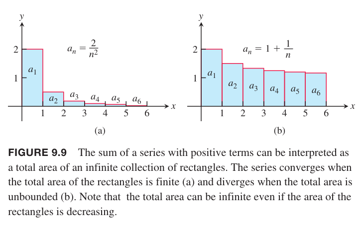

无穷级数（`infinite series`）是无穷数列的和
$$a_1+a_2+a_3+\cdots+a_n+\cdots$$
对于无穷数列，我们无法一个一个相加完成，不过我们可以先看前 $n$ 项和
$$s_n=a_1+a_2+a_3+\cdots+a_n$$
这称为前 $n$ 项部分和。随着 $n$ 越来越大，我们期望部分和趋于某个极限，就和之前讨论的数列的极限一样。

比如，无穷级数
$$1+\frac{1}{2}+\frac{1}{4}++\frac{1}{8}+\cdots$$
的前 $n$ 项和是
$$s_n=2-\frac{1}{n^{n-1}}$$
因为 $\lim_{n\to\infty}(1/2^{n-1})=0$，所以部分和的数列趋于 2，那么我们说无穷级数 $1+\frac{1}{2}+\frac{1}{4}++\frac{1}{8}+\cdots$ 的和是 2。

**定义**
> 给定数列 $\{a_n\}$，表达式
> $$a_1+a_2+a_3+\cdots+a_n+\cdots$$
> 是无穷级数。级数的第 $n$ 项是 $a_n$。数列 $\{s_n\}$ 定义为
> $$\begin{aligned}
> s_1&=a_1\\
> s_2&=a_1+a_2\\
> &\vdots\\
> s_n&=a_1+a_2+a_3+\cdots+a_n\\
> &\vdots
> \end{aligned}$$
> 被称为级数的部分和数列，$s_n$ 是第 $n$ 个部分和。如果部分和数列收敛到 $L$，那么级数收敛且和是 $L$，记作
> $$a_1+a_2+a_3+\cdots+a_n+\cdots=\sum_{n=1}^\infty=L$$
> 否则，我们称级数发散。

我们可以把无穷级数的每一项看作是一个矩形。如果项 $a_n$ 都是正的，如果总面积有限，那么级数收敛，否则发散。下图展示了这两种情况。

总面积收敛与广义积分相关，下一节会阐述两者的联系。

给定无穷级数 $a_1+a_2+a_3+\cdots+a_n+\cdots$，我们不知道其是收敛还是发散，但是不妨碍我们使用希格玛符号
$$\sum_{n=1}^\infty a_n,\sum_{k=1}^\infty a_k,\sum a_n$$

### 几何级数
几何级数（`geometric series`）形式如下
$$$$
