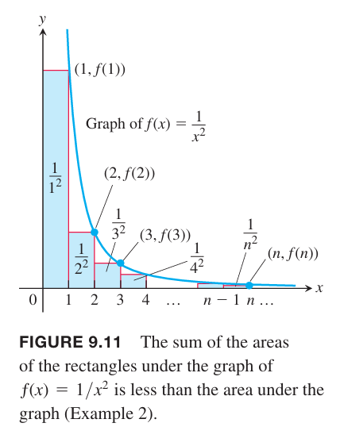

### 非递减部分和
假设 $\sum_{n=1}^\infty a_n$ 是无穷级数，且对于所有 $n$ 都有 $a_n\geq 0$。由于 $s_{n+1}=s_n+a_{n+1}$，那么部分和数列的每一项大于等于前一个
$$s_1\leq s_2\leq s_3\leq\cdots\leq s_n\leq s_{n+1}\leq\cdots$$
根据 9.1 节定理 6 单调数列定理，部分和非递减，那么有以下推论。

**定理6 的推论**
> 非负级数 $\sum_{n=1}^\infty a_n$ 收敛等价于它的部分和有上界。

例1 考虑调和级数
$$\sum_{n=1}^\infty\frac{1}{n}=1+\frac{1}{2}+\frac{1}{3}+\cdots+\frac{1}{n}+\cdots$$
尽管第 $n$ 项 $\frac{1}{n}$ 趋于零，但是由于部分和无上界，所以级数发散。下面证明部分和没有上界。按照下面对各项进行分组
$$\sum_{n=1}^\infty\frac{1}{n}=1+\frac{1}{2}+(\frac{1}{3}+\frac{1}{4})+(\frac{1}{5}+\cdots+\frac{1}{8})+(\frac{1}{9}+\cdots+\frac{1}{16})+\cdots$$
每个分组的和都大于 $1/2$。一般地，以 $2^{n+1}$ 的分组，有 $2^n$ 个值，和大于 $1/2$。如果 $n=2^k$，那么 $s_n>k/2$，无上界。

### 积分测试
下面通过计算类似调和级数的 $1/n^2$ 数列阐述如何使用积分测试判定收敛性。

例2 下面的级数是否收敛？
$$\sum_{n=1}^\infty\frac{1}{n^2}=1+\frac{1}{4}+\frac{1}{9}+\cdots+\frac{1}{n^2}+\cdots$$
解：我们可以通过计算积分 $\int_1^\infty (1/x^2)dx$ 来判定 $\sum_{n=1}^\infty 1/n^2$ 是否收敛。函数 $f(x)=1/x^2$ 对应整数的值可以看作是数列的每一项，而每一项的值可以看作是曲线 $y=1/x^2$ 下矩形的面积。如下图所示。

$$\begin{aligned}
s_n&=\frac{1}{1^2}+\frac{1}{2^2}+\frac{1}{3^2}+\cdots+\frac{1}{n^2}\\
&=f(1)+f(2)+f(3)+\cdots+f(n)\\
&<f(1)+\int_1^n\frac{1}{x^2}dx\\
&<f(1)+\int_1^\infty\frac{1}{x^2}dx\\
&=1+1\\
&=2
\end{aligned}$$
因此 $\sum_{n=1}^\infty 1/n^2$ 的部分和有上界，2，所以级数收敛。

**定理9 积分测试**
> 令 $\{a_n\}$ 是正数项的数列。假设 $a_n=f(n)$，$f$ 是在 $x\geq N>0$ 上连续的、正数、非递减函数。那么级数 $\sum_{n=N}^\infty a_n$ 和积分 $\int_N^\infty f(x)dx$ 收敛性相同。

证明：下面证明 $N=1$，一般情况类似。

观察上图（a），从 $x=1$ 到 $x=n+1$，$y=f(x)$ 曲线下的面积小于 $a_1,a_2,\cdots,a_n$ 对应的矩形面积和，即
$$\int_1^{n+1}f(x)dx\leq a_1+a_2+\cdots+a_n$$
用左边界代替有边界，得到图（b），排除第一个矩阵 $a_1$，有
$$a_2+a_3+\cdots+a_n\leq\int_1^n f(x)dx$$
两边加上 $a_1$
$$a_1+a_2+a_3+\cdots+a_n\leq a_1+\int_1^n f(x)dx$$
那么
$$\int_1^{n+1}f(x)dx\leq a_1+a_2+\cdots+a_n\leq a_1+\int_1^n f(x)dx$$
如果 $\int_1^\infty f(x)dx$ 有限，即收敛，那么根据右边的不等式，$\sum a_n$ 也是有限的，收敛。反之 $\int_1^\infty f(x)dx$ 无限，那么级数也无限。

例3 证明当 $p>1$ 时，$p$ 级数
$$$$
收敛，当 $p<1$ 时，级数发散。

证明：

$$\tag*{$\blacksquare$}$$
