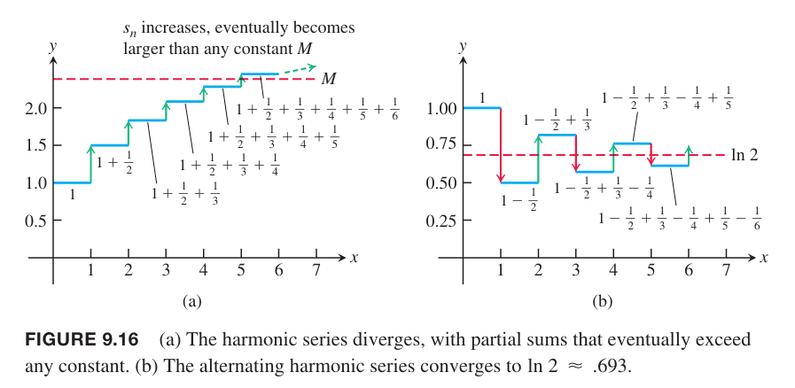

如果一个级数的项是正数和负数交错的，那么这个级数称为交错级数（`alternating series`）。下面是几个交错级数的例子：
$$1-\frac{1}{2}+\frac{1}{3}-\frac{1}{4}+\frac{1}{5}-\cdots+\frac{(-1)^{n+1}}{n}+\cdots$$
$$-2+1-\frac{1}{2}+\frac{1}{4}-\frac{1}{8}+\cdots+\frac{(-1)^n4}{2^n}+\cdots$$
$$1-2+3-4+5-6+\cdots+(-1)^{n+1}n+\cdots$$
交错级数的项形式如下
$$a_n=(-1)^{n+1}u_n,a_n=(-1)^n u_n$$
其中 $u_n=|a_n|$ 是正数。

上面第一个级数是交错调和级数，很快将会证明其是收敛的。第二个级数是公比 $r=-1/2$ 的等比级数，收敛于 $-2/(1-(-1/2))=-4/3$。第三个级数发散，因为第 $n$ 项不趋于零。

可以使用下面给出的交错级数测试来判定一个交错级数是否收敛。这个测试仅能判定级数收敛而不能得到级数发散的结论。如果将级数 $u_1-u_2+u_3-u_4+\cdots$ 乘以 -1，可以得到级数 $-u_1+u_2-u_3+u_4-\cdots$。所以只讨论形如前者的级数的收敛性即可。

**定理 15 交错级数测试**
> 级数
> $$\sum_{n=1}^\infty(-1)^{n+1}u_n=u_1-u_2+u_3-u_4+\cdots$$
> 满足如下三个条件，那么是收敛的。
> 1. $u_n$ 都是正数
> 2. $u_n$ 最终是非递增的，即 $u_n\geq u_{n+1},n\geq N$
> 3. $u_n\to 0$

证明：这里证明 $N=1$ 的情况，$u_1,u_2,u_3,\cdots$ 是非递增的。如果 $n$ 是偶数，$n=2m$，前 $n$ 项和是
$$\begin{aligned}
s_{2m}&=(u_1-u_2)+(u_3-u_4)+\cdots+(u_{2m-1}-u_{2m})\\
&=u_1-(u_2-u_3)-(u_4-u_5)-\cdots-(u_{2m-2}-u_{2m-1})-u_{2m}
\end{aligned}$$
由于第一个等式的每一项大于等于零，所以 $s_{2m}$ 是 $m$ 个非负数之和，进而有 $s_{2m+2}\geq s_{2m}$，所以数列 $\{s_{2m}\}$ 是非递增数列。第二个等式证明了 $s_{2m}\leq u_1$。所以 $\{s_{2m}\}$ 非递增且有上界，那么它存在极限
$$\lim_{m\to\infty}s_{2m}=L$$
如果 $n$ 是级数，$n=2m+1$，那么前 $n$ 项和 $s_{2m+1}=s_{2m}+u_{2m+1}$。因为 $u_n\to 0$，所以
$$\lim_{m\to\infty}u_{2m+1}=0$$
因此 $m\to\infty$ 时有
$$s_{2m+1}=s_{2m}+u_{2m+1}\to L+0=L$$
综上，$\lim_{m\to\infty}s_{n}=L$。

例1 交错调和级数
$$\sum_{n=1}^\infty(-1)^{n+1}\frac{1}{n}=1-\frac{1}{2}+\frac{1}{3}-\frac{1}{4}+\frac{1}{5}-\cdots+\frac{(-1)^{n+1}}{n}+\cdots$$
满足定理 15 的三个条件，所以是收敛的。不过，这个测试并没有给出级数的和是多少。下图展示了调和级数和交错调和级数的部分和。观察可知交错调和级数收敛于 $\ln 2$。

除了直接验证 $u_n\geq u_{n+1}$ 之外，可以构造一个可微函数 $f(x)$ 满足 $f(n)=u_n$ 来证明 $\{u_n\}$ 最终是非递增的。如果，对于 $x\geq N$ 都有 $f'(x)<0$，那么 $f(n)\geq f(n+1),u_n\geq u_{n+1},n\geq N$。

例2 通过上述方法证明 $u_n=10n/(n^2+16)$ 最终是非递增的。令 $f(x)=10x/(x^2+16)$。根据导数的商法则，
$$f'(x)=\frac{10(16-x^2)}{(x^2+16)^2}\leq 0,x\geq 4$$
那么有 $u_n\geq u_{n+1},n\geq 4$，所以 $\{u_n\}$ 最终是非递增的。
