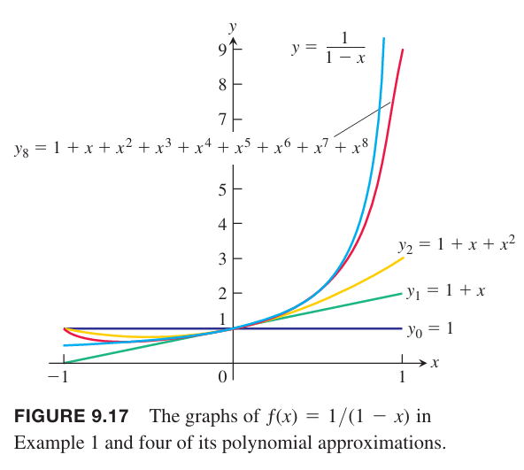

### 幂级数和收敛
**定义**
> $x=0$ 附近的幂级数是形式如下的幂级数
> $$\sum_{n=0}^\infty c_nx^n=c_0+c_1x^1+c_2x^2+\cdots+c_nx^n+\cdots\tag{1}$$
> $x=a$ 附近的幂级数是形式如下的幂级数
> $$\sum_{n=0}^\infty c_n(x-a)^n=c_0+c_1(x-a)^1+c_2(x-a)^2+\cdots+c_n(x-a)^n+\cdots\tag{2}$$
> 其中 $a$ 是中心，$c_0,c_1,c_2,\cdots,c_n,\cdots$ 是常数，称为系数（`coefficient`）。

例1 方程 $(1)$ 的系数如果全为 1，那么得到如下等比级数
$$\sum_{n=1}^\infty x_n=1+x+x^2+\cdots+x^n+\cdots$$
这是一个初始项为 1 公比为 $x$ 的等比数列。如果 $|x|<1$，那么收敛到 $1/(1-x)$。写作
$$\frac{1}{1-x}=1+x+x^2+\cdots+x^n+\cdots,-1<x<1\tag{3}$$

我们从另一个角度审视 $(3)$：等式右边，级数的部分和是多项式 $P_n(x)$ 是左边函数的近似。在 $x=0$ 附近，很少的项之和就是很好的近似，如果我们观察 $x=1,-1$ 的附近，需要更多的项来近似。如下图所示。函数 $f(x)=1/(1-x)$ 在 $x=1$ 处不连续，这里有垂直渐近线。当 $x\geq 1$ 时，近似就不再适用了。

例2 幂级数
$$1-\frac{1}{2}(x-2)+\frac{1}{4}(x-2)^2+\cdots+(-\frac{1}{2})^n(x-2)^n+\cdots$$
和 $(2)$ 形式一样，$a=2,c_0=1,c_1=-1/2,c_2=1/4,\cdots,c_n=(-1/2)^n,\cdots$。这是一个初始项为 1 公比 $r=-\frac{x-2}{2}$ 的等比级数。当 $|\frac{x-2}{2}|<1$，即 $0<x<4$ 时，级数收敛。和为
$$\frac{1}{1-r}=\frac{1}{1+\frac{x-2}{2}}=\frac{2}{x}$$
那么，这个多项式是在 $x=2$ 附近函数 $f(x)=2/x$ 的近似。
$$\begin{aligned}
P_0(x)&=1\\
P_1(x)&=1-\frac{1}{2}(x-2)=2-\frac{x}{2}\\
P_2(x)&=1-\frac{1}{2}(x-2)+\frac{1}{4}(x-2)^2=3-\frac{3x}{2}+\frac{x^2}{4}
\end{aligned}$$

下面的例子使用比值测试法来判定幂级数的收敛性。

例3 当 $x$ 值为多少时，下面级数收敛。
（a）
$$\sum_{n=1}^\infty(-1)^{n-1}\frac{x^n}{n}=x-\frac{x^2}{2}+\frac{x^3}{3}-\cdots$$
（b）
$$\sum_{n=1}^\infty(-1)^{n-1}\frac{x^{2n-1}}{2n-1}=x-\frac{x^3}{3}+\frac{x^5}{5}-\cdots$$
（c）
$$\sum_{n=0}^\infty\frac{x^n}{n!}=1+x+\frac{x^2}{2!}+\frac{x^3}{3!}+\cdots$$
（d）
$$\sum_{n=0}^\infty n!x^n=1+x+2!x^2+3!x^3+\cdots$$
解：对级数 $\sum|u_n|$ 使用比值测试，其中 $u_n$ 是幂级数的第 $n$ 项。

（a）

### 
