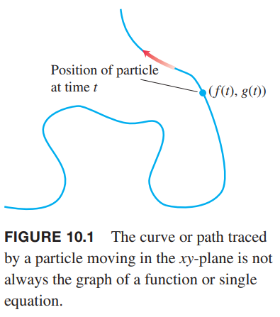
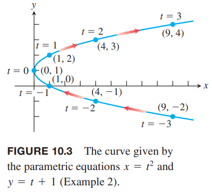

### 参数方程
如下图所示是一个粒子在 $xy$ 平面上运动的轨迹。注意这个曲线无法用 $x$ 的函数表示。不过，我们有时可以用一组方程 $x=f(t),y=g(t)$ 描述轨迹，其中 $f,g$ 都是连续函数。当研究运动时，$t$ 表示时间。

**定义**
> 如果 $x,y$ 是关于 $t$ 在区间 $I$ 上的函数
> $$x=f(t),y=g(t)$$
> 点集 $(x,y)=(f(t),g(t))$ 是参数曲线（`parametric curve`），这组方程是曲线的参数方程（`parametric equations`）。

变量 $t$ 是曲线的参数（`parameter`），定义域 $I$ 是参数区间（`parameter interval`）。如果 $I$ 是闭区间，即 $a\leq t\leq b$，那么点 $(f(a),g(a))$ 是曲线的起点（`initial point`），$(f(b),g(b))$ 是曲线的终点（`terminal point`）。当我们定义参数方程和参数区间时，我们有一条参数化（`parametrized`）的曲线。方程和区间共同构成了曲线的参数化（`parametrization`）。给定的曲线可以表示成不同的参数方程的几何。（TODO 习题 29 30）

例1 画出由下面参数方程定义的曲线的轮廓。
$$x=\sin \pi t/2,y=t,0\leq t\leq 6$$
解：如下图所示。

我们把这个曲线想象成一个运动粒子的路径，当 $t=0$ 时，粒子处于 $(0,0)$ 处，然后蜿蜒向上运动，直到 $t=0$ 时在点 $(0,6)$ 处终值。运动方向如箭头所示。

例2 画出由下面参数方程定义的曲线的轮廓。
$$x=t^2,y=t+1,-\infty<t<\infty$$
解：如下图所示。

各个点之间的时间间隔是相同的，但是曲线的长度却差距很大。当粒子接近 $y$ 轴的时候，随着 $t$ 的增加，粒子运动的越来越慢，反之，当粒子远离 $y$ 轴的时候，粒子运动的越来越快。由于 $t$ 的区间是所有实数，所以这个曲线没有起点也没有终点。

对于这个例子，我们可以使用代数的方法消除 $t$，得到仅有 $x,y$ 的方程。
$$x=t^2=(y-1)^2=y^2-2y-1$$
这是一个抛物线。有时，消除参数是很困难的，甚至是不可能的。

例3 
