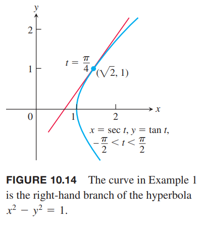

### 切线和面积
如果函数 $f,g$ 在 $t$ 可微，那么参数化曲线 $f(t),g(t)$ 在 $t$ 处是可微的。在可微曲线上，$y$ 是 $x$ 的可微函数，根据链式法则 $dy/dt,dx/dt,dy/dx$ 的关系如下
$$\frac{dy}{dt}=\frac{dy}{dx}\frac{dx}{dt}$$
如果 $dx/dt\neq 0$，两边除以 $dx/dt$ 可以 $dy/dx$。

> $dy/dx$ 的参数公式
> 如果三个导数都存在，且 $dx/dt\neq 0$，那么
> $$\frac{dy}{dx}=\frac{dy/dt}{dx/dt}$$

如果参数方程定义 $y$ 是 $x$ 二阶可微函数，令 $dy/dx=y'$，可以计算 $d^2y/dx^2$
$$\frac{d^2y}{dx^2}=\frac{d}{dx}(y')=\frac{dy'/dt}{dx/dt}$$

> $d^2y/dx^2$ 的参数公式
> 如果方程 $x=f(t),y=g(t)$ 定义 $y$ 是 $x$ 二阶可微函数，在任意点处有 $dx/dt\neq 0$，且 $y'=dy/dx$，那么
> $$\frac{d^2y}{dx^2}=\frac{dy'/dt}{dx/dt}$$

例1 求曲线
$$x=\sec t,y=\tan t,-\frac{\pi}{2}<t<\frac{\pi}{2}$$
在点 $(\sqrt{2},1)$ 处的切线，此时 $t=\pi/4$。如下图所示。

解：曲线在 $t$ 点的斜率是
$$\frac{dy}{dx}=\frac{dy/dt}{dx/dt}=\frac{\sec^2 t}{\sec t\tan t}=\frac{\sec t}{\tan t}=\frac{1}{\sin t}$$
当 $t=\pi/4$ 时
$$\frac{dy}{dx}\bigg|_{t=\pi/4}=\frac{1}{\sin(\pi/4)}=\frac{1}{1/\sqrt{2}}=\sqrt{2}$$
那么切线是
$$\begin{aligned}
y-1&\sqrt{2}(x-\sqrt{2})\\
y&=\sqrt{2}x-1
\end{aligned}$$

例2 如果 $x=t-t^2,y=t-t^3$，求 $d^2y/dx^2$。

解：用 $t$ 表示 $y'=dy/dx$
$$y'=\frac{dy}{dx}=\frac{dy/dt}{dx/dt}=\frac{1-3t^2}{1-2t}$$
对 $y'$ 求导
$$\frac{dy'}{dt}=\frac{d}{dt}(\frac{1-3t^2}{1-2t})=\frac{2-6t+6t^2}{(1-2t)^2}$$
$dy'/dt$ 除以 $dx/dt$
$$\frac{d^2y}{dx^2}=\frac{dy'/dt}{dx/dt}=\frac{\frac{2-6t+6t^2}{(1-2t)^2}}{1-2t}=\frac{2-6t+6t^2}{(1-2t)^3}$$

例3 求下面参数方程表示的星形线围城的面积。
$$x=\cos^3 t,y=\sin^3 t,0\leq t\leq 2\pi$$

解：根据定义，我们只需要计算第一象限的面积，即 $0\leq t\leq \pi/2$，然后乘以 4 即可。
$$\begin{aligned}
A&=4\int_0^1ydx\\
&=4\int_0^{\pi/2}(\sin^3 t)(3\cos^2 t\sin t)dt\\
&=12\int_0^{\pi/2}(\frac{1-\cos 2t}{2})^2(\frac{1+\cos 2t}{2})dt&&\sin^4 t=(\frac{1-\cos 2t}{2})^2\\
&=\frac{3}{2}\int_0^{\pi/2}(1-2\cos 2t+\cos^2 2t)(1+\cos 2t)dt\\
&=\frac{3}{2}\int_0^{\pi/2}(1-\cos 2t-cos^2 2t+\cos^3 2t)dt\\
&=\frac{3}{2}[\int_0^{\pi/2}(1-\cos 2t)dt-\int_0^{\pi/2}cos^2 2tdt+\int_0^{\pi/2}\cos^3 2tdt]\\
&=\frac{3}{2}[(t-\frac{1}{2}\sin 2t)-\frac{1}{2}(t+\frac{1}{4}\sin 2t)+\frac{1}{2}(\sin 2t-\frac{1}{3}\sin^3 2t)]_0^{\pi/2}\\
&=\frac{3}{2}[(\frac{\pi}{2}-0-0-0)-\frac{1}{2}(\frac{\pi}{2}+0-0-0)+\frac{1}{2}(0-0-0+0)]\\
&=\frac{3\pi}{8}
\end{aligned}$$

### 参数化曲线的长度

