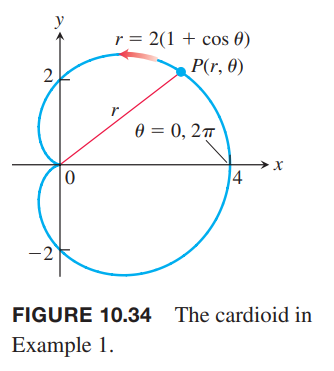

### 面积
如下图所示，区域 OTS 由射线 $\theta=\alpha,\theta=\beta$ 和曲线 $r=f(\theta)$ 包围起来的。我们使用 $n$ 个不重叠的扇形来近似这个区域。第 $k$ 个分区的弧度是 $\Delta\theta_k$ 半径是 $r_k=f(\theta_k)$。面积是半径为 $r_k$ 的圆的面积乘以 $\Delta\theta_k/2\pi$
$$A_k=\frac{1}{2}r_k^2\Delta\theta_k=\frac{1}{2}(f(\theta_k))^2\Delta\theta_k$$

那么整个 OTS 的面积是
$$\sum_{k=1}^nA_k=\sum_{k=1}^n\frac{1}{2}(f(\theta_k))^2\Delta\theta_k$$
随着分区 $P$ 的模趋于零，这个近似值会无限趋于实际值，其中 $P$ 的模是 $\Delta\theta_k$ 的最大值。因此可以得到公式
$$A=\lim_{||P||\to 0}\sum_{k=1}^n\frac{1}{2}(f(\theta_k))^2\Delta\theta_k=\int_\alpha^\beta\frac{1}{2}(f(\theta))^2d\theta$$

**原点和曲线间扇形的面积**
> $r=f(\theta),\alpha\leq\theta\leq\beta,r\geq 0,\beta-\alpha\leq 2\pi$
> $$A=\int_\alpha^\beta\frac{1}{2}r^2d\theta$$
> 这是面积微分的积分
> $$dA=\frac{1}{2}r^2d\theta=\frac{1}{2}(f(\theta))^2d\theta$$
> 

上面的面积公式要求 $r\geq 0$ 且扫过的角度不超过 $2\pi$。这就避免了面积的符号是负的，且出现了重叠。如果需要，可以把一个区域分解成若干个上述要求的区域，然后求解。

例1 求心脏线 $r=2(1+\cos\theta)$ 包围的区域的面积。

解：如下图所示。

随着 $\theta$ 从 0 到 $2\pi$，半径 OP 恰好只扫过一次。因此面积是
$$\begin{aligned}
\int_{\theta=0}^{\theta=2\pi}\frac{1}{2}r^2d\theta&=\int_0^{2\pi}\frac{1}{2}\cdot 4(1+\cos\theta)^2d\theta\\
&=\int_0^{2\pi}2(1+2\cos\theta+\cos^2\theta)d\theta\\
&=\int_0^{2\pi}(2+4\cos\theta+2\cdot\frac{1+\cos 2\theta}{2})d\theta\\
&=\int_0^{2\pi}(3+4\cos\theta+\cos 2\theta)d\theta\\
&=\bigg[3\theta+4\sin\theta+\frac{\sin 2\theta}{2}\bigg]_0^{2\pi}\\
&=6\pi
\end{aligned}$$

求解下图这样区域的面积时，我们可以用 $(1/2)r_1^2d\theta$ 减去 $(1/2)r_2^2d\theta$。

**环形面积**
> $0\leq r_1(\theta)\leq r\leq r_2(\theta),\alpha\leq\theta\leq\beta,\beta-\alpha\leq 2\pi$
> $$A=\int_\alpha^\beta\frac{1}{2}r_2^2d\theta-\int_\alpha^\beta\frac{1}{2}r_1^2d\theta=\int_\alpha^\beta\frac{1}{2}(r_2^2-r_1^2)d\theta\tag{1}$$

例2 求圆 $r=1$ 以内，心脏线 $r=1-\cos\theta$ 以外区域的面积。

解：画出草图以确定要求的区域的面积，如下如所示。

外面的曲线是 $r=1$，里面的曲线是 $r=1-\cos\theta$，$\theta$ 的范围是从 $-\pi/2$ 到 $\pi/2$，那么根据公式 $(1)$
$$\begin{aligned}
A&=\int_{-\pi/2}^{\pi/2}\frac{1}{2}(r_2^2-r_1^2)d\theta\\
&=2\int_{-\pi/2}^{0}\frac{1}{2}(r_2^2-r_1^2)d\theta\\
&=\int_{-\pi/2}^{0}(1-(1-\cos\theta)^2)d\theta\\
&=\int_{-\pi/2}^{0}(1-(1-2\cos\theta+\cos^2\theta))d\theta\\
&=\int_{-\pi/2}^{0}(2\cos\theta-\cos^2\theta)d\theta\\
&=\int_{-\pi/2}^{0}(2\cos\theta-\frac{1+\cos 2\theta}{2}\theta)d\theta\\
&=\bigg[2\sin\theta-\frac{\theta}{2}-\frac{\sin 2\theta}{4}\bigg]_0^{2\pi}\\
&=2-\frac{\pi}{4}
\end{aligned}$$

### 
