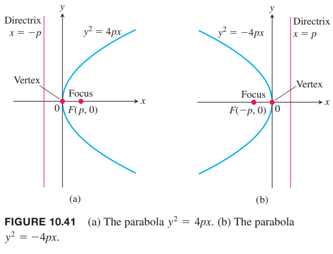

这一节我们会从几何角度定义并研究抛物线、椭圆和双曲线，并且推导它们的笛卡尔坐标系下的方程。这些曲线都称为圆锥曲线（`conic sections` `conics`），因为它们可以由一个平截截一个双锥体得到。如下图所示。

### 抛物线
**定义**
> 在一个平面上，抛物线（`parabola`）是到定点距离等于到定直线距离相等的点的集合。这个定点是抛物线的焦点（`focus`）。这个定直线是抛物线的准线（`directrix`）。

如果焦点 $F$ 在准线 $L$ 上，那么抛物线是通过点 $F$ 且垂直于 $L$ 的直线。这是一种退化情况，因此这里假定 $F$ 不在 $L$ 上。

最简单的抛物线方程是焦点和准线在坐标轴两边。假定焦点 $F(0,p)$ 在 $y$ 轴上，准线是直线 $y=-p$。如下图所示。

点 $P(x,y)$ 在抛物线上等价于 $PF=PQ$。由距离公式有
$$PF=\sqrt{(x-0)^2+(y-p)^2}=\sqrt{x^2+(y-p)^2}$$
$$PQ=\sqrt{(x-x)^2+(y-(-p))^2}=\sqrt{(y+p)^2}$$
联立方程，平方，化简得到
$$y=\frac{x^2}{4p},x^2=4py\tag{1}$$
这个方程揭示了抛物线关于 $y$ 轴对称。称 $y$ 轴为抛物线的轴（抛物线对称轴的简称）。

抛物线和坐标轴的交点称为顶点（`vertex`）。抛物线 $x^2=4py$ 的顶点是原点（如上图）。正数 $p$ 是抛物线的焦距（`focal length`）。

如果抛物线开口向下，那么焦点是 $(0,-p)$，准线是 $y=p$，那么方程 $(1)$ 变成了
$$y=-\frac{x^2}{4p},x^2=-4py$$

将 $x,y$ 互换，得到开口向左或向右的类似抛物线的方程。

例1 求抛物线 $y^2=10x$ 的焦点和准线。

解：从标准方程 $y^2=4px$ 求 $p$。
$$4p=10,p=\frac{5}{2}$$
因此焦点是
$$(p,0)=(\frac{5}{2},0)$$
准线是
$$x=-p,x=-\frac{5}{2}$$

### 椭圆
**定义**
> 在一个平面内，椭圆（`ellipse`）是到两个顶点的距离之和是常数的点的集合。这两个定点称为椭圆的焦点。
>
> 椭圆的焦点确定的直线称为焦轴（`focal axis`）。两个焦点的中点称为中心（`center`）。椭圆和焦轴的交点称为顶点（`vertices`）。
>
> 

如下图所示，如果焦点是 $F_1(-c,0),F_2(c,0)$，将 $PF_1+PF_2$ 表示为 $2a$，那么椭圆上的点 $P$ 满足方程
$$\sqrt{(x+c)^2+y^2}+\sqrt{(x-c)^2+y^2}=2a$$

为了简化方程，可以把第二项根式移到等式右边，然后平方，将根式分离到等式一遍，再平方，化简，得到
$$\frac{x^2}{a^2}+\frac{y^2}{a^2-c^2}=1\tag{2}$$
三角形 $PF_1F_2$ 两个之和大于第三边，那么 $PF_1+PF_2>F_1F_2$，即 $2a>2c$，那么方程 $(2)$ 中的 $a^2-c^2>0$。

推导方程 $(2)$ 的步骤可逆，那么就证明了一个点 $P$ 满足这样 $0<c<a$ 的方程，那么就满足椭圆的条件 $PF_1+PF_2=2a$。因此，一个点在椭圆上等价于它的坐标满足方程 $(2)$。

令 $b$ 表示 $a^2-c^2$ 的正根
$$b=\sqrt{a^2-c^2}\tag{3}$$
将 $b^2=a^2-c^2$ 代入方程 $(2)$
$$\frac{x^2}{a^2}+\frac{y^2}{b^2}=1\tag{4}$$
方程 $(4)$ 说明椭圆关于两个坐标轴、原点对称。它位于由 $x=\pm a,y=\pm b$ 的矩形内，和坐标轴的交点是 $(\pm a,0),(0,\pm b)$。这些点处的切线垂直于坐标轴，因为从 方程 $(4)$ 作隐式求导可以得到
$$\frac{dy}{dx}=-\frac{b^2x}{a^2y}$$
当 $x=0$ 时，斜率为 0。当 $y=0$ 时，斜率无穷大。

方程 $(4)$ 的椭圆的长轴（`major axis`）是连接点 $(\pm a,0)$ 的长为 $2a$ 线段。
