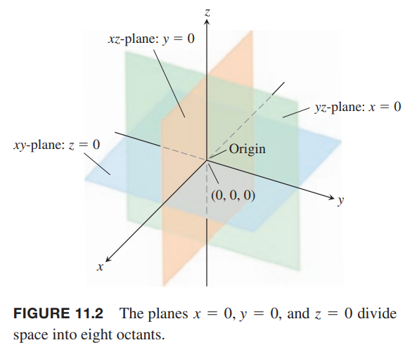
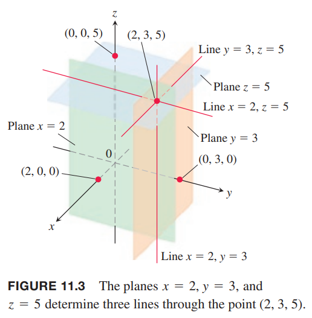
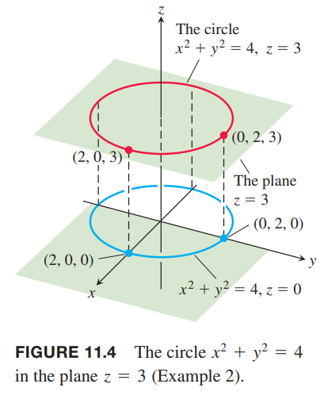
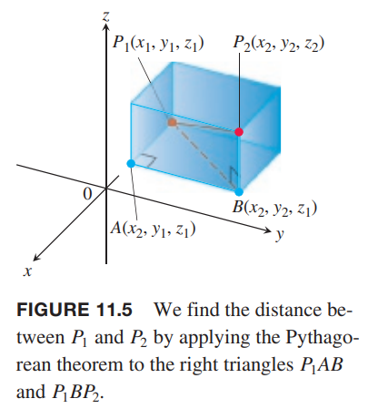

为了标记空间的某点，我们使用三个相互垂直的坐标轴，如下图所示。

这是右手坐标系（`right-handed coordinate frame`），当四指从 $x$ 轴弯向 $y$ 轴时，大拇指指向 $z$ 轴方向。当从 $z$ 轴正半轴向下望时，从 $x$ 轴开始逆时针绕着 $z$ 轴转的角的角度是正数。左手坐标系（`left-handed
coordinate frame`）刚好相反。

笛卡尔坐标系中，空间中某点 $P$ 的坐标是 $(x,y,z)$，各个值是过 $P$ 点且与各个轴垂直的平面与各个轴相交点的坐标值。空间笛卡尔坐标系也称为直角坐标系（`rectangular coordinates`），因为各个轴相互垂直，夹角是直角。$x$ 轴上的点 $y,z$ 轴的值是零，即 $(x,0,0)$。其他轴也类似，坐标分别是 $(0,y,0),(0,0,z)$。

由坐标轴确定的 $xy$ 平面的标准方程是 $z=0$，$yz$ 平面的方程是 $x=0$，$xz$ 平面的方程是 $y=0$。它们相交于原点（`origin`）$(0,0,0)，如下图所示。原点也经常简写为 0 或者字母 $O$。

三个坐标平面（`coordinate planes`）把空间分成了八个象限（`octants`，八分仪），三个坐标都是正数的象限称为第一象限（`first octant`），其他七个象限没有约定俗成的名字。

在垂直于 $x$ 轴的平面内的点 $x$ 轴坐标都是一样的，$y,z$ 轴对应值可以是任意值。其他轴也类似。平面 $x=2$ 是通过 $x$ 轴上 $x=2$ 这一点且与 $x$ 轴垂直的平面，平面 $y=3,z=5$ 也类似。如下图所示。三个平面的交点是 $(2,3,5)$。

平面 $x=2,y=3$ 的交线平行于 $z$ 轴，使用一对方程 $x=2,y=3$ 描述这条直线。点 $(x,y,z)$ 在直线上等价于 $x=2,y=3$。平面 $y=3,z=5$ 和 $x=2,z=5$ 类似。

例1 解释如下方程或不等式。

（1）
$$z\geq 0$$
$xy$ 平面之上的半个空间。

（2）
$$x=-3$$
与 $x$ 轴垂直且交点是 $x=3$ 的平main。

（3）
$$z=0,x\leq 0,y\leq 0$$
$xy$ 平面的第二象限。

（4）
$$x\geq 0,y\geq 0,z\geq 0$$
第一象限。

（5）
$$-1\leq y\leq 1$$
平面 $y=1,y=-1$ 之间的厚板。

（6）
$$y=-2,z=2$$
由平面 $y=-2,z=2$ 相交形成的直线。通过点 $(0,-2,2)$ 且与 $x$ 轴平行的直线。

例2 什么样的点 $(x,y,z)$ 满足
$$x^2+y^2=4,z=3$$
解：点位于平面 $z=3$ 上，且形成了圆 $x^2+y^2=4$。可以点的集合是在平面 $z=3$ 上的圆 $x^2+y^2=4$，或者是圆 $x^2+y^2=4,z=3$。如下图所示。

### 空间中的距离和球体
> 点 $P_1(x_1,y_1,z_1)$ 到点 $P_2(x_2,y_2,z_2)$ 的距离是
> $$|P_1P_2|=\sqrt{(x_2-x_1)^2+(y_2-y_1)^2+(z_2-z_1)^2}$$

证明：构造一个立方体，$P_1,P_2$ 是对顶点，各个面平行于坐标平面，如下图所示。

点 $A(x_2,y_1,z_1),B(x_2,y_2,z_1)$ 是立方体的两个顶点，那么立方体的三边长分别是
$$|P_1,A|=|x_2-x_1|,|AB|=|y_2-y_1|,|BP_2|=|z_2-z_1|$$
又因为角 $P_1AB$ 和角 $P_1BP_2$ 都是直角，所以
$$|P_1B|^2=|P_1A|^2+|AB|^2,|P_1P_2|^2=|P_1B|^2+|BP_2|^2$$
那么
$$\begin{aligned}
|P_1P_2|^2&=|P_1B|^2+|BP_2|^2\\
&=|P_1A|^2+|AB|^2+|BP_2|^2\\
\end{aligned}$$
