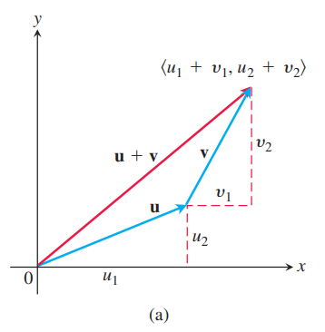

对于一些量，比如力、位移、速度，我们不仅需要知道其大小，还需要知道它的方向。这一节主要讲解在平面或空间中如何表示这些既有大小又有方向的量。

### 分量形式
我们将像力、位移、速度这样的量称为矢量（`vector`），使用有向线段表示。如下图所示。

箭头的方向表示矢量的方向，在单位长度选定的情况下长度表示大小。下图表示在平面或者空间中，一个粒子在沿着给定路径运动时，在指定点处速度矢量 $\boldsymbol{v}$。

**定义**
> 使用有向线段 $\overrightarrow{AB}$ 来表示，其中 $A$ 是起点（`initial point`），$B$ 是终点（`terminal point`），长度（`length`）用 $|\overrightarrow{AB}|$ 表示。如果两个矢量的方向和长度一样，那么这两个矢量相等（`equal`）。

不管起点在哪里，有相同的方向和长度的矢量就都是相等的。如下图中的矢量都是相等的。

书本中使用去小写粗体表示矢量，比如 $\boldsymbol{u},\boldsymbol{v},\boldsymbol{w}$，有时也使用大写粗体，比如 $\boldsymbol{F}$。书写时，在字母上方加一个箭头，比如 $\overrightarrow{u},\overrightarrow{v},\overrightarrow{w},\overrightarrow{F}$。

我们需要使用代数的方式精确地表示矢量的方向。令 $\boldsymbol{v}=\overrightarrow{PQ}$。那么存在一个有向线段等于 $\overrightarrow{PQ}$ 且起点位于原点处。如下图所示。这就是矢量 $\boldsymbol{v}$ 在标准位置（`standard position`）的表示，也是通常表示矢量 $\boldsymbol{v}$ 的方式。

当 $\boldsymbol{v}$ 在标准位置时，使用终点 $(v_1,v_2,v_3)$ 表示矢量 $\boldsymbol{v}$。如果是二维平面，那么使用终点 $(v_1,v_2)$ 表示矢量 $\boldsymbol{v}$。

**定义**
> 如果二维（`two-dimensional`）矢量 $\boldsymbol{v}$ 等于一个起点位于原点终点位于 $(v_1,v_2)$ 的矢量，那么 $\boldsymbol{v}$ 的分量形式（`component form`）是
> $$\boldsymbol{v}=\langle v_1,v_2\rangle$$
> 如果三维（`three-dimensional`）矢量 $\boldsymbol{v}$ 等于一个起点位于原点终点位于 $(v_1,v_2,v_3)$ 的矢量，那么 $\boldsymbol{v}$ 的分量形式（`component form`）是
> $$\boldsymbol{v}=\langle v_1,v_2,v_3\rangle$$

所以二维矢量是有序实数对 $\boldsymbol{v}=\langle v_1,v_2\rangle$，三位矢量是有序三元组 $\boldsymbol{v}=\langle v_1,v_2,v_3\rangle$。数 $v_1,v_2,v_3$ 是矢量 $\boldsymbol{v}$ 的分量。

如果矢量 $\boldsymbol{v}=\langle v_1,v_2,v_3\rangle$ 用有向线段 $\overrightarrow{PQ}$ 表示，其起点是 $P(x_1,y_1,z_1)$，终点是 $Q(x_2,y_2,z_2)$，那么 $x_1+v_1=x_2,y_1+v_1=y_2,z_1+v_1=z_2$，因此 $\overrightarrow{PQ}$ 的分量是 $v_1=x_2-x_1,v_2=y_2-y_1,v_3=z_2-z_1$。

简而言之，给定点 $P(x_1,y_1,z_1)$ 和点 $Q(x_2,y_2,z_2)$，那么与 $\overrightarrow{PQ}$ 相等的标准位置矢量是
$$\boldsymbol{v}=\langle x_2-x_1,y_2-y_1,z_2-z_1\rangle$$

二维矢量和三维矢量类似，只需要去掉第三个分量即可。

两个矢量相等等价于它们的标准位置矢量是一样的。因此 $\langle u_1,u_2,u_3\rangle$ 和 $\langle v_1,v_2,v_3\rangle$ 相等等价于 $u_1=v_1,u_2=v_2,u_3=v_3$。

矢量 $\overrightarrow{PT}$ 的长度或大小（`magnitude`）是有向线段的长度。如果 $\boldsymbol{v}=\langle x_2-x_1,y_2-y_1,z_2-z_1\rangle$ 是矢量 $\overrightarrow{PQ}$ 的标准位置矢量，那么距离公式就给出了 $\boldsymbol{v}$ 的长度，用符号 $|\boldsymbol{v}|$ 或 $||\boldsymbol{v}||$ 表示。

> 矢量 $\boldsymbol{v}=\overrightarrow{PQ}$ 的长度或大小是
> $$|\boldsymbol{v}|=\sqrt{v_1^2+v_2^2+v_3^2}=\sqrt{(x_2-x_1)^2+(y_2-y_1)^2+(z_2-z_1)^2}$$

只有一个矢量的长度是零，即零矢量（`zero vector`）$\boldsymbol{0}=\langle0,0\rangle$ 或 $\boldsymbol{0}=\langle0,0,0\rangle$。这个矢量也是唯一一个没有指定方向的矢量。

例1 求起点是 $P(-3,4,1)$ 终点是 $Q(-5,2,2)$ 的矢量的分量形式和长度。

解：表示 $\overrightarrow{PQ}$ 的标准位置矢量 $\boldsymbol{v}$ 的分量是
$$v_1=x_2-x_1=-2,v_2=y_2-y_1=-2,v_3=z_2-z_1=1$$
所以 $\overrightarrow{PQ}$ 的分量形式是
$$\boldsymbol{v}=\langle-2,-2,1\rangle$$
长度是
$$|\boldsymbol{v}|=\sqrt{(-2)^2+(-2)^2+1^2}=\sqrt{9}=3$$

例2 一辆小车沿着水平方向运动，有一个力 $\boldsymbol{F}$ 与地面夹角是 $45^\circ$，大小是 $20N$，如下图所示。求向前的有效力的大小是多少？

解：有效力是矢量 $\boldsymbol{F}=\langle a,b\rangle$ 的水平分量，因此
$$a=|\boldsymbol{F}|\cos 45^\circ=20\frac{\sqrt{2}}{2}\approx 14.14N$$

### 矢量代数操作
这里涉及两个操作：矢量加法（`vector addition`）和标量乘法（`scalar multiplication`）。标量（`scalar`）就是一个实数，这里这么称呼的原因是与矢量区别开来。标量可以是正数、负数或零，与矢量相乘可以对其进行缩放。

**定义**
> 令 $\boldsymbol{u}=\langle u_1,u_2,u_3\rangle,\boldsymbol{v}=\langle v_1,v_2,v_3\rangle$ 是矢量，$k$ 是标量
> $$\boldsymbol{u+v}=\langle u_1+v_1,u_2+v_2,u_3+v_3\rangle$$
> $$k\boldsymbol{u}=\langle ku_1,ku_2,ku_3\rangle$$

矢量的加法就是对应分量相加。矢量乘以标量，就是标量乘以矢量的每一个分量。上述定义对二维矢量也成立。

矢量加法的几何解释如下图所示，其中一个矢量的起点放到另外一个矢量的终点。

另外一种几何解释如下图所示，称为加法的平行四边形法则（`parallelogram law`），和称为合矢量（`resultant vector`），是平行四边形的对角线。物理学中，力、速度、加速度的加法都遵循平行四边形法则。

下图是标量 $k$ 乘以矢量 $\boldsymbol{u}$ 的几何解释。如果 $k>0$，那么 $k\boldsymbol{u}$ 与矢量 $\boldsymbol{u}$ 同方向，如果 $k<0$，那么 $k\boldsymbol{u}$ 与矢量 \boldsymbol{u} 反方向。

两者的长度关系如下
$$\begin{aligned}
|k\boldsymbol{u}|&=\sqrt{(ku_1)^2+(ku_2)^2+(ku_3)^2}\\
&=\sqrt{k^2(u_1^2+u_2^2+u_3^2)}\\
&=\sqrt{k^2}\sqrt{u_1^2+u_2^2+u_3^2}\\
&=|k||\boldsymbol{u}|
\end{aligned}$$

$k\boldsymbol{u}$ 的长度是标量 $k$ 的绝对值乘以矢量 $\boldsymbol{u}$ 的长度。矢量 $(-1)\boldsymbol{u}=\boldsymbol{u}$ 的长度和矢量 $\boldsymbol{u}$ 相同，但是方向相反。

两个矢量的差（`difference`）$\boldsymbol{u}-\boldsymbol{v}$ 的定义是
$$\boldsymbol{u}-\boldsymbol{v}=\boldsymbol{u}+(-\boldsymbol{v})$$
如果 $\boldsymbol{u}=\langle u_1,u_2,u_3\rangle,\boldsymbol{v}=\langle v_1,v_2,v_3\rangle$，那么
$$\boldsymbol{u}-\boldsymbol{v}=\langle u_1-v_1,u_2-v_2,u_3-v_3\rangle$$

注意 $(\boldsymbol{u}-\boldsymbol{v})+\boldsymbol{v}=\boldsymbol{u}$，所以矢量 $\boldsymbol{u}-\boldsymbol{v}$ 和 $\boldsymbol{v}$ 的加法如下图（a）所示，矢量差 $\boldsymbol{u}-\boldsymbol{v}$ 是矢量和 $\boldsymbol{u}+(-\boldsymbol{v})$，如下图（b）所示。

