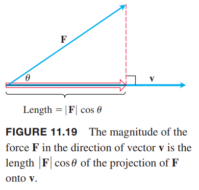
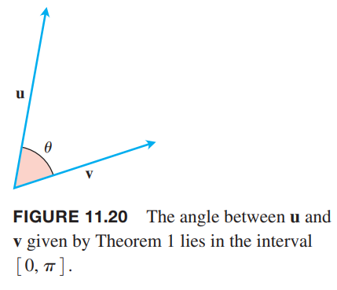
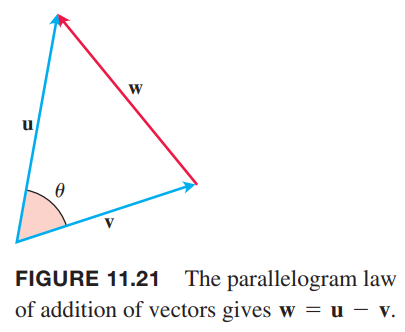

如果力 $\boldsymbol{F}$ 作用于一个运动中的粒子，我们需要知道力在运动方向上的大小。如果速度 $\boldsymbol{v}$ 平行于力 $\boldsymbol{F}$ 作用点的切线，那么我们想知道的就是在 $\boldsymbol{v}$ 方向上力 $\boldsymbol{F}$ 的大小。如下图所示，大小就是 $\boldsymbol{F}\cos\theta$，其中 $\theta$ 是两个矢量 $\boldsymbol{F},\boldsymbol{v}$ 的夹角。

这一节主要讲解如何通过矢量分量直接计算夹角。关键部分就是矢量的点积（`dot product`），也称为内积或标量积（` inner product`, `scalar product`）。

### 矢量夹角
将两个矢量 $\boldsymbol{u},\boldsymbol{v}$ 的起点重合，形成了一个夹角 $\theta$，其中 $0\leq\theta\leq\pi$。

如果两个矢量不在同一条直线上，那么 $\theta$ 位于两个矢量确定的平面上。如果在同一条直线上的话，方向一致则夹角为零，方向相反则夹角为 $\pi$。角 $\theta$ 是矢量 $\boldsymbol{u},\boldsymbol{v}$ 的夹角。

**定理 1 —— 两个矢量的夹角**
> 两个矢量 $\boldsymbol{u}=\langle u_1,u_2,u_3\rangle,\boldsymbol{v}=\langle v_1,v_2,v_3\rangle$ 的夹角 $\theta$ 是
> $$\theta=\cos^{-1}\bigg(\frac{u_1v_1+u_2v_2+u_3v_3}{|\boldsymbol{u}||\boldsymbol{v}|}\bigg)$$

在证明之前，我们先看下分子上的式子 $u_1v_1+u_2v_2+u_3v_3$，它是矢量 $\boldsymbol{u},\boldsymbol{v}$ 相应分量的积的和。

**定义**
> 矢量 $\boldsymbol{u},\boldsymbol{v}$ 的点积（`dot product`）$\boldsymbol{u}\cdot\boldsymbol{v}$ 是标量
> $$\boldsymbol{u}\cdot\boldsymbol{v}=u_1v_1+u_2v_2+u_3v_3$$

例1

（a）
$$\langle 1,-2,-1\rangle\cdot\langle -6,2,-3\rangle=-6+(-4)+3=-7$$
（b）
$$\bigg(\frac{1}{2}\boldsymbol{i}+3\boldsymbol{j}+\boldsymbol{k}\bigg)\cdot(4\boldsymbol{i}-\boldsymbol{j}+2\boldsymbol{k})=2-3+2=-1$$

两个二维矢量的点积类似。
$$\boldsymbol{u}\cdot\boldsymbol{v}=\langle u_1,u_2\rangle\cdot\langle v_1,v_2\rangle=u_1v_1+u_2v_2$$

证明：如上图所示，根据 1.3 节余弦定理有
$$\begin{aligned}
|\boldsymbol{w}|^2&=|\boldsymbol{u}|^2+|\boldsymbol{v}|^2-2|\boldsymbol{u}||\boldsymbol{v}|\cos\theta\\
2|\boldsymbol{u}||\boldsymbol{v}|\cos\theta&=|\boldsymbol{u}|^2+|\boldsymbol{v}|^2-|\boldsymbol{w}|^2
\end{aligned}$$
由于 $\boldsymbol{w}=\boldsymbol{u}-\boldsymbol{v}$，其分量是 $\langle u_1-v_1,u_2-v_2,u_3-v_3\rangle$，那么
$$\begin{aligned}
|\boldsymbol{u}|^2&=(\sqrt{u_1^2+u_2^2+u_3^2})^2=u_1^2+u_2^2+u_3^2\\
|\boldsymbol{v}|^2&=(\sqrt{v_1^2+v_2^2+v_3^2})^2=v_1^2+v_2^2+v_3^2\\
|\boldsymbol{w}|^2&=(u_1-v_1)^2+(u_2-v_2)^2+(u_3-v_3)^2\\
&=u_1^2-2u_1v_1+v_1^2+u_2^2-2u_2v_2+v_2^2+u_3^2-2u_3v_3+v_3^2
\end{aligned}$$
因此
$$|\boldsymbol{u}|^2+|\boldsymbol{v}|^2-|\boldsymbol{w}|^2=2(u_1v_1+u_2v_2+u_3v_3)$$
因此
$$\begin{aligned}
2|\boldsymbol{u}||\boldsymbol{v}|\cos\theta&=|\boldsymbol{u}|^2+|\boldsymbol{v}|^2-|\boldsymbol{w}|^2=2(u_1v_1+u_2v_2+u_3v_3)\\
|\boldsymbol{u}||\boldsymbol{v}|\cos\theta&=u_1v_1+u_2v_2+u_3v_3\\
\cos\theta&=\frac{u_1v_1+u_2v_2+u_3v_3}{|\boldsymbol{u}||\boldsymbol{v}|}
\end{aligned}$$
由于 $0\leq\theta\leq\pi$，有
$$\theta=\cos^{-1}\bigg(\frac{u_1v_1+u_2v_2+u_3v_3}{|\boldsymbol{u}||\boldsymbol{v}|}\bigg)$$

**点积和夹角**
> 非零矢量 $\boldsymbol{u},\boldsymbol{v}$ 的夹角
> $$\theta=\cos^{-1}\bigg(\frac{\boldsymbol{u}\cdot\boldsymbol{v}}{|\boldsymbol{u}||\boldsymbol{v}|}\bigg)$$
> 两个矢量 $\boldsymbol{u},\boldsymbol{v}$ 的点积
> $$\boldsymbol{u}\cdot\boldsymbol{v}=|\boldsymbol{u}||\boldsymbol{v}|\cos\theta$$

例2 

### 正交矢量

### 点积属性和矢量投影

### 功
