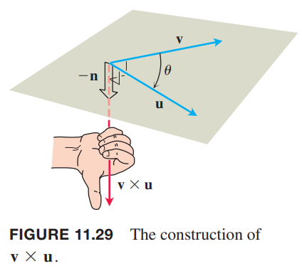
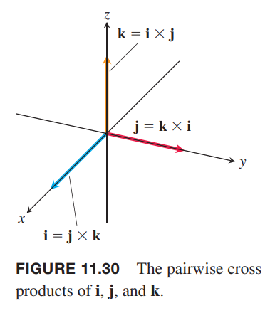
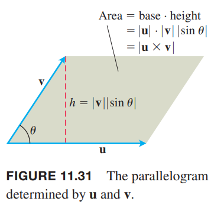

类似于使用斜率表示直线的倾斜程度，我们使用空间中两个矢量的乘积得到的第三个矢量来表示又这两个矢量确定的平面的“倾斜”度。这种乘法称为矢量积或者叉积（`vector
or cross product`）。

### 空间中两个矢量的叉积
我们从研究空间中的两个非零矢量 $\boldsymbol{u},\boldsymbol{v}$ 开始。如果其中一个乘以非零数得到另一个矢量，那么这两个矢量平行。如果矢量不平行，那么它们确定了一个平面。在这个平面的矢量都是矢量 $\boldsymbol{u},\boldsymbol{v}$ 的线性组合，写作 $a\boldsymbol{u}+b\boldsymbol{v}$。根据右手螺旋规则（`right-hand rule`）确定垂直于平面的单位矢量 $\boldsymbol{n}$。右手四指从 $\boldsymbol{u}$ 弯曲到 $\boldsymbol{v}$，大拇指方向就是 $\boldsymbol{n}$ 的方向，转过的角度记为 $\theta$。如下图所示。那么就可以定义一个新的矢量了。

**定义**
> 矢量 $\boldsymbol{u}$ 和 $\boldsymbol{v}$ 的叉积是矢量
> $$\boldsymbol{u}\times\boldsymbol{v}=(|\boldsymbol{u}||\boldsymbol{v}|\sin\theta)\boldsymbol{n}$$

和点积不同，叉积的结果也是一个矢量，所以称为矢量积，并且不适用于二维矢量。矢量 $\boldsymbol{u}\times\boldsymbol{v}$ 是 $\boldsymbol{n}$ 与标量的乘积，与之平行，所以与 $\boldsymbol{u},\boldsymbol{v}$ 都垂直。

后续将讲解不涉及夹角的计算叉积的方法，先关注叉积的属性。

由于 0 和 $\pi$ 的正弦值是 0，所以两个平行的矢量的叉积是零矢量，$\boldsymbol{0}$。如果 $\boldsymbol{u},\boldsymbol{v}$ 其中一个或两个是零矢量，那么 $\boldsymbol{u}\times\boldsymbol{v}$ 也是零矢量。

**平行矢量**
> 非零矢量 $\boldsymbol{u},\boldsymbol{v}$ 平行等价于 $\boldsymbol{u}\times\boldsymbol{v}=\boldsymbol{0}$。

**叉积属性**
> 如果 $\boldsymbol{u},\boldsymbol{v},\boldsymbol{w}$ 是矢量，$r,s$ 是标量，那么
> $$(r\boldsymbol{u})\times(s\boldsymbol{v})=(rs)(\boldsymbol{u}\times\boldsymbol{v})$$
> $$\boldsymbol{u}\times(\boldsymbol{v}+\boldsymbol{w})=\boldsymbol{u}\times\boldsymbol{v}+\boldsymbol{u}\times\boldsymbol{w}$$
> $$\boldsymbol{v}\times\boldsymbol{u}=-(\boldsymbol{u}\times\boldsymbol{v})$$
> $$(\boldsymbol{v}+\boldsymbol{w})\times\boldsymbol{u}=\boldsymbol{v}\times\boldsymbol{u}+\boldsymbol{w}\times\boldsymbol{u}$$
> $$\boldsymbol{0}\times\boldsymbol{u}=\boldsymbol{u}$$
> $$\boldsymbol{u}\times(\boldsymbol{v}\times\boldsymbol{w})=(\boldsymbol{u}\cdot\boldsymbol{w})\boldsymbol{v}-(\boldsymbol{u}\cdot\boldsymbol{v})\boldsymbol{w}$$

属性 3 的可视化如下图所示。四指从 $\boldsymbol{u}$ 到 $\boldsymbol{v}$ 和从 $\boldsymbol{v}$ 到 $\boldsymbol{u}$ 弯曲，大拇指方向恰好相反。

第一个属性可以通过叉积的定义证明。

第二个属性证明如下。TODO Appendix 10

第二个属性两边同时乘以 -1，然后应用第三个属性翻转叉积顺序得到第四个属性。

第五个属性就是定义。

第六个属性说明一般情况下，叉积不遵循结合律。与 $\boldsymbol{u}\times(\boldsymbol{v}\times\boldsymbol{w})=(\boldsymbol{u}\cdot\boldsymbol{w})\boldsymbol{v}-(\boldsymbol{u}\cdot\boldsymbol{v})\boldsymbol{w}$ 类似，$(\boldsymbol{u}\times\boldsymbol{v})\times\boldsymbol{w}=(\boldsymbol{u}\cdot\boldsymbol{w})\boldsymbol{v}-(\boldsymbol{w}\cdot\boldsymbol{w})\boldsymbol{u}$，但二者往往不相等。

使用第三个属性，可以得到 $\boldsymbol{i},\boldsymbol{j},\boldsymbol{k}$ 两两叉积。
$$\boldsymbol{i}\times\boldsymbol{j}=-(\boldsymbol{j}\times\boldsymbol{i})=\boldsymbol{k}$$
$$\boldsymbol{j}\times\boldsymbol{k}=-(\boldsymbol{k}\times\boldsymbol{j})=\boldsymbol{i}$$
$$\boldsymbol{k}\times\boldsymbol{i}=-(\boldsymbol{i}\times\boldsymbol{k})=\boldsymbol{j}$$
并且
$$\boldsymbol{i}\times\boldsymbol{i}=\boldsymbol{j}\times\boldsymbol{j}=\boldsymbol{k}\times\boldsymbol{k}=\boldsymbol{0}$$

### 叉积是平行四边形面积
由于 $\boldsymbol{n}$ 是单位矢量，所以 $\boldsymbol{u}\times\boldsymbol{v}$ 的大小是
$$|\boldsymbol{u}\times\boldsymbol{v}|=|\boldsymbol{u}||\boldsymbol{v}||\sin\theta||\boldsymbol{n}|=|\boldsymbol{u}||\boldsymbol{v}|\sin\theta$$
这是由 $\boldsymbol{u},\boldsymbol{v}$ 确定的平行四边形的面积。$|\boldsymbol{u}$ 是底，$|\boldsymbol{v}||\sin\theta|$ 是高。

### 叉积的行列式公式
假设
$$\boldsymbol{u}=u_1\boldsymbol{i}+u_2\boldsymbol{j}+u_3\boldsymbol{k},\boldsymbol{v}=v_1\boldsymbol{i}+v_2\boldsymbol{j}+v_3\boldsymbol{k}$$
根据叉积的分配律和 $\boldsymbol{i},\boldsymbol{j},\boldsymbol{k}$ 的叉积结果可以得到
$$\begin{aligned}
\boldsymbol{u}\times\boldsymbol{v}&=&&(u_1\boldsymbol{i}+u_2\boldsymbol{j}+u_3\boldsymbol{k})\times(v_1\boldsymbol{i}+v_2\boldsymbol{j}+v_3\boldsymbol{k})\\
&=&&u_1v_1\boldsymbol{i}\times\boldsymbol{i}+u_1v_2\boldsymbol{i}\times\boldsymbol{j}+u_1v_3\boldsymbol{i}\times\boldsymbol{k}\\
&&+&u_2v_1\boldsymbol{j}\times\boldsymbol{i}+u_2v_2\boldsymbol{j}\times\boldsymbol{j}+u_2v_3\boldsymbol{j}\times\boldsymbol{k}\\
&&+&u_3v_1\boldsymbol{k}\times\boldsymbol{i}+u_3v_2\boldsymbol{k}\times\boldsymbol{j}+u_3v_3\boldsymbol{k}\times\boldsymbol{k}\\
&=&&(u_2v_3-u_3v_2)\boldsymbol{i}-(u_1v_3-u_3v_1)\boldsymbol{j}+(u_1v_2-u_2v_1)\boldsymbol{k}
\end{aligned}$$
最后一行比较难记，下面的行列式是同样的结果，但是很容易记忆
$$\begin{vmatrix}
\boldsymbol{i}&\boldsymbol{j}&\boldsymbol{k}\\
u_1&u_2&u_3\\
v_1&v_2&v_3
\end{vmatrix}$$

**行列式计算叉积**
> 如果 $\boldsymbol{u}=u_1\boldsymbol{i}+u_2\boldsymbol{j}+u_3\boldsymbol{k},\boldsymbol{v}=v_1\boldsymbol{i}+v_2\boldsymbol{j}+v_3\boldsymbol{k}$，那么
> $$\boldsymbol{u}\times\boldsymbol{v}=\begin{vmatrix}
\boldsymbol{i}&\boldsymbol{j}&\boldsymbol{k}\\
u_1&u_2&u_3\\
v_1&v_2&v_3
\end{vmatrix}$$
